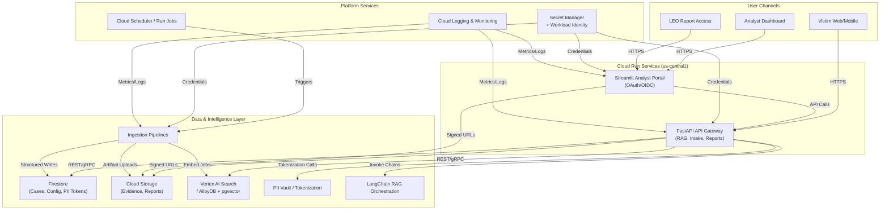
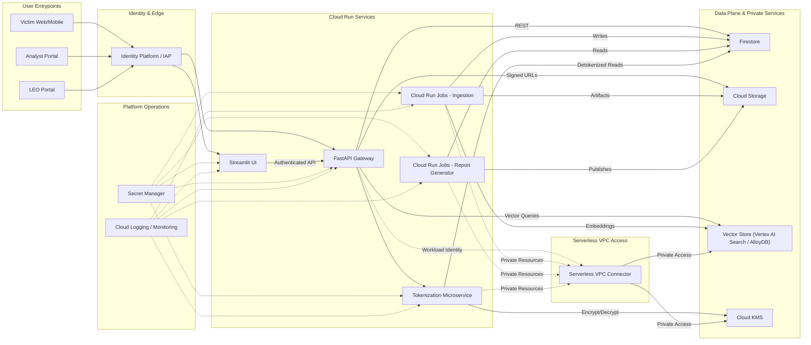
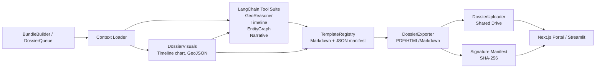

# i4g System Architecture

> **Document Version**: 1.3
> **Last Updated**: December 14, 2025
> **Audience**: Engineers, technical stakeholders, university partners

---

## Executive Summary

**i4g** is a cloud-native, AI-powered platform that helps scam users document fraud and generate law enforcement reports. The system uses a **privacy-by-design** architecture where personally identifiable information (PII) is tokenized immediately upon upload and stored separately from case data.

You now run two first-party consoles. The **Next.js portal** on Cloud Run serves victims, volunteer analysts, and law enforcement officers through server-side proxy routes that preserve the privacy guarantees described below. The **Streamlit operations console** stays online for internal developers and sys-admins who need dashboards, data analytics, and live ingestion telemetry without exposing those tools to external users.

**Key Design Principles**:
1. **Zero Trust**: No analyst ever sees raw PII
2. **Serverless**: Zero budget constraint drives Cloud Run deployment
3. **Scalability**: Handles 20 concurrent users on GCP free tier
4. **Security**: AES-256-GCM encryption, OAuth 2.0, Firestore rules

## Guiding Objectives

- **Parity then extension**: Maintain feature parity with the retired Azure stack before adding net-new workflows.
- **Open-first**: Prefer open protocols/OSS-aligned services and keep clean swap points (Vertex ↔ pgvector, Gemini ↔ Ollama).
- **Operate light**: Favor repeatable runbooks and Workload Identity over long-lived keys so small teams can maintain it.
- **Privacy by design**: Deterministic tokenization, sharded artifact storage, and auditable access across services.
- **Cost-aware**: Stay within free-tier/nonprofit credits; degrade gracefully to local mocks when managed services are off.

## Deployment Profiles (Managed vs Local)

| Capability / Service | Managed (Cloud Run / GCP) | Local / Laptop Profile | Swap Mechanism |
|---|---|---|---|
| Identity | Google Cloud Identity Platform (OIDC) | Local mock OIDC provider or stub JWT signer for development | `settings.identity.provider` (`google_identity` vs `dev_stub`); toggle via `I4G_ENV` + `.env.local`. |
| API Gateway / FastAPI | Cloud Run service with Workload Identity | Docker container running FastAPI with `.env` config | `settings.runtime.mode` (`managed` / `local`); `make run-fastapi` uses local profile. |
| Analyst UI | Streamlit on Cloud Run (authenticated) | Streamlit app run locally with dev auth toggles | `settings.ui.base_url` + `settings.auth.mock_tokens`; `make run-analyst-ui`. |
| Retrieval & Vector Store | Vertex AI Search (default) | Dockerized Postgres + pgvector or local Chroma | `settings.vector.backend` (`vertex_ai`, `pgvector`, `chroma`); hot-swappable through `VectorClient`. |
| LLM Inference | Vertex AI Gemini 1.5 Pro | Ollama running locally or mock responses | `settings.llm.provider` (`vertex_ai`, `ollama`, `dummy`); pluggable LangChain `LLMFactory`. |
| Storage | Firestore + Cloud Storage buckets | Local SQLite/JSON stores + filesystem folders | `settings.storage.mode` (`firestore`, `sqlite_fs`); mounts via `.env.local` paths. |
| Ingestion Jobs | Cloud Run Jobs + Scheduler | Local scripts invoked via `make ingest-*` with stub schedules | `scripts/ingest/*` honour `settings.jobs.enabled`; local cron disabled by default. |
| Observability | Cloud Logging/Monitoring with OpenTelemetry exporters | Console logs + optional local OTLP collector (Docker) | `settings.telemetry.otlp_endpoint`; default empty routes to stdout. |
| Secrets | Secret Manager, Workload Identity | `.env.local` (gitignored) + Pydantic overrides | `settings.secrets.provider` (`secret_manager`, `env`); helper resolves per environment. |

> The managed and local profiles share the same configuration contract, so swapping between environments is a matter of
> setting `I4G_ENV` and the relevant overrides. A sample Docker Compose bundle will accompany Milestone 3 to spin up
> pgvector, Chroma, or Ollama when testing offline parity.

## Configuration Strategy

- Central `settings` package built on Pydantic BaseSettings loads defaults, then environment-specific config, then
  developer overrides. Always fetch via `i4g.settings.get_settings()` so Workload Identity/env overrides take effect.
- `I4G_ENV` selects `local`, `dev`, or `prod` with this stack order: baked-in defaults → env-specific config files
  (`config/settings.*.toml`) → `.env.local` (gitignored) → env vars (`I4G_*`, double underscores for nesting).
- Managed environments resolve secrets from Secret Manager; local profile falls back to `.env.local` to avoid accidental
  writes to production resources.
- Services share the same configuration contract so API, UI, jobs, and notebooks stay in sync. Local profile enables
  mock identity, SQLite structured store, Chroma vectors, Ollama LLM, Secret Manager disabled, and scheduled jobs off.

---

## High-Level Architecture

This section merges the previously archived future-state plan into the active architecture view so the diagrams and
component descriptions stay in one place.

### Future-State Topology



### Cloud Run Deployment Swimlanes



The swimlanes emphasize the Cloud Run deployment boundary: Identity-Aware Proxy fronts the stateless FastAPI and
Streamlit services, while background Cloud Run jobs handle ingestion and reporting. Workload Identity supplies secrets
from Secret Manager, and the shared VPC connector enables private access to the vector store or KMS when those
resources require it. Observability remains centralized through Cloud Logging and Monitoring across all containers.

### Current Logical Layout

```
┌──────────────────────────────────────────────────────────┐
│                      User Layer                          │
│  ┌──────────┐      ┌──────────┐      ┌──────────┐        │
│  │  User    │      │ Analyst  │      │   LEO    │        │
│  └────┬─────┘      └────┬─────┘      └────┬─────┘        │
└───────┼─────────────────┼─────────────────┼──────────────┘
        │                 │                 │
        │ HTTPS           │ HTTPS           │ HTTPS
        │                 │                 │
┌───────┼─────────────────┼─────────────────┼──────────────┐
│       │     GCP Cloud Run (us-central1)   │              │
│  ┌────▼─────────────────▼─────────────────▼────┐         │
│  │         Load Balancer (HTTPS)               │         │
│  └──┬─────────────────────┬────────────────────┘         │
│     │                     │                              │
│  ┌──▼─────────┐      ┌────▼──────────┐                   │
│  │  FastAPI   │      │  Next.js      │                   │
│  │  Backend   │      │  Analyst      │                   │
│  │  (Python)  │      │  Console      │                   │
│  └──┬─────────┘      └────┬──────────┘                   │
└─────┼─────────────────────┼──────────────────────────────┘
      │                     │
      │   Firestore API     │
      │                     │
┌─────▼─────────────────────▼──────────────────────────────┐
│                  Data Layer (GCP)                        │
│  ┌──────────────┐  ┌────────────┐  ┌───────────┐  ┌────────────┐
│  │  Firestore   │  │   Cloud    │  │  Secret   │  │ Vertex AI  │
│  │   (NoSQL)    │  │  Storage   │  │  Manager  │  │  Search    │
│  └──────┬───────┘  └────────────┘  └───────────┘  └────────────┘
└─────────┼────────────────────────────────────────────────┘
          │
          │  Cloud SQL (ingestion + entity tables)
          │
┌─────────▼────────────────────────────────────────────────┐
│                 Dual Extraction Indexes                  │
│  ┌──────────────┐    ┌───────────────┐                   │
│  │ Cloud SQL /  │    │ Vertex AI     │                   │
│  │ AlloyDB      │    │ Search Corpus │                   │
│  └──────────────┘    └───────────────┘                   │
└─────────┬────────────────────────────────────────────────┘
          │
          │ HTTP (localhost:11434)
          │
┌─────────▼────────────────────────────────────────────────┐
│               External Services                          │
│  ┌──────────────┐    ┌────────────┐                      │
│  │    Ollama    │    │  SendGrid  │                      │
│  │  LLM Server  │    │   Email    │                      │
│  └──────────────┘    └────────────┘                      │
└──────────────────────────────────────────────────────────┘
```

### Dossier Flow — Agentic Evidence Dossiers

This section documents the architecture and data-flow for evidence dossier generation and distribution. It is intended as a stable, long-lived reference for engineers and reviewers.

- Source diagram (editable): https://drive.google.com/drive/folders/1z7pg_D0k6fiRQdw_pejeDBav49xdvnqL?usp=drive_link
- Local draw.io version: `docs/diagrams/dossier_flow.drawio` (importable into diagrams.net)
 - Local mermaid snapshot mirrors the Drive version for offline readers.



---

## Component Architecture

### 1. **FastAPI Backend**

**Responsibilities**:
- REST API endpoints for case management
- PII tokenization and encryption
- LLM-powered scam classification
- Authentication (OAuth 2.0 JWT validation)
- Firestore CRUD operations

**Technology Stack**:
- Python 3.11
- FastAPI 0.104+ (async/await support)
- LangChain 0.2+ (RAG pipeline)
- google-cloud-firestore (database client)
- google-cloud-storage (file uploads)
- cryptography (AES-256-GCM encryption)

**Key Endpoints**:
- `POST /api/cases` - Submit new case
- `GET /api/cases` - List assigned cases
- `GET /api/cases/{id}` - Get case details (PII masked)
- `PATCH /api/cases/{id}` - Update case status
- `POST /api/cases/{id}/approve` - Generate LEO report
- `GET /api/health` - Health check

Note: The `POST /api/cases` endpoint above is listed as a planned user-facing intake route in the architecture. In the current implementation this exact endpoint is not present — case intake is handled via the review queue and review-related routes (see `src/i4g/api/review.py` and the `/reviews` router). Consider this endpoint "planned" until a dedicated intake route is added.

---

### 2. **Experience Layer**

#### Next.js External Portal

**Responsibilities**:
- Orchestrate the full victim → analyst → law enforcement workflow with OAuth-backed authentication
- Expose search, review, approval, and report delivery experiences through a React UI that mirrors the FastAPI contracts
- Render case detail pages with evidence thumbnails, inline entity highlighting, and Discovery powered search facets
- Provide bulk report exports, smoke-test hooks, and future citizen-facing intake forms without revealing backend secrets

**Technology Stack**:
- Node.js 20 (Cloud Run)
- Next.js 15 App Router with React 19 RC and TypeScript
- Tailwind CSS, `@i4g/ui-kit`, and shared design tokens
- `@i4g/sdk` with an adapter selected via `I4G_API_KIND` (core vs mock)

**Key Features**:
- Hybrid rendering (Server Components + edge-ready client interactivity)
- Cloud Run friendly build (PNPM workspaces, multi-stage Dockerfile)
- API route proxy that injects server-only secrets for FastAPI calls
- Configurable mock mode for demos without backend dependencies

#### Streamlit Operations Console

**Responsibilities**:
- Give internal developers and sys-admins a fast path to query cases, review ingestion telemetry, and validate Discovery relevance tuning
- Host privileged dashboards (PII handling audit trails, queue depth monitors, weekly migration metrics) without impacting the hardened external portal
- Surface ad-hoc data science notebooks and quick visualizations that do not belong in the production-facing UI

**Technology Stack**:
- Python 3.11 with Streamlit 1.28+
- Shared component library (`i4g.ui.widgets`) to reuse FastAPI schemas directly in widgets
- OAuth session reuse via the same FastAPI-issued JWTs consumed by Next.js

**Key Features**:
- Runs behind Cloud Run IAM so only on-call engineers and sys-admins can launch it
- Ships with environment toggles (`I4G_ENV`, `I4G_ANALYTICS_MODE`) to switch between local SQLite/Chroma and GCP services
- Imports `i4g.services.discovery` directly so Discovery experiments stay consistent with the backend

### 3a. **Account List Extraction Service**

**Responsibilities**:
- Expose `POST /accounts/extract` for on-demand analyst runs with API-key enforcement (`X-ACCOUNTLIST-KEY`).
- Coordinate retrieval (`FinancialEntityRetriever`), LLM extraction (`AccountEntityExtractor`), and artifact generation (`AccountListExporter`).
- Publish CSV/JSON/XLSX/PDF outputs to the local reports directory, Cloud Storage, or Google Drive (when configured) and return signed links to the caller and the Streamlit console.
- Power the Cloud Run job `account-list` (scheduled via Cloud Scheduler) so recurring exports share the exact same code path as the interactive API.

**Technology Stack**:
- Python 3.11 shared package (`src/i4g/services/account_list/*`).
- LangChain + Ollama locally (Vertex AI/Gemini ready once service accounts are wired).
- ReportLab + OpenPyXL for artifact rendering.
- Cloud Run job container (`i4g-account-job` entrypoint) plus optional Google Drive uploads via ADC scopes.

**Key Features**:
- Category catalog (bank, crypto, payments today; IP/ASN/browser planned) driven by configuration so new indicators only need prompt/query definitions.
- Deduplication + metadata summary stored alongside artifacts, surfaced in the Streamlit dashboard via a summary/status table.
- Manual smoke harness (`tests/adhoc/account_list_export_smoke.py`) to verify exporter plumbing without hitting the LLM stack.
- FastAPI also exposes `/accounts/runs`, enabling the analyst console’s new `/accounts` page to trigger manual runs, refresh audit history via server-side API routes, and expose artifact links / warnings inline without leaking service credentials to the browser.

---

### 3b. **Dual Extraction Ingestion Pipeline**

**Responsibilities**:
- Normalize Discovery bundles into structured case/entity payloads (`ingest_payloads.prepare_ingest_payload`).
- Execute `i4g.worker.jobs.ingest`, which orchestrates entity extraction, SQL writes (`SqlWriter`), Firestore fan-out (`FirestoreWriter`), and Vertex AI Search document imports (`VertexWriter`).
- Persist ingestion run metrics plus retry payloads so operators can audit progress (`IngestionRunTracker`) and replay failed Firestore/Vertex batches via `i4g.worker.jobs.ingest_retry`.

**Technology Stack**:
- Python workers launched locally or via Cloud Run jobs using `conda run -n i4g python -m i4g.worker.jobs.{ingest,ingest_retry}`.
- Cloud SQL / SQLite for `cases`, `entities`, and `ingestion_runs`; Firestore for analyst-facing case documents; Vertex AI Search (`retrieval-poc`) for semantic retrieval.
- Settings-driven toggles (`I4G_STORAGE__FIRESTORE_PROJECT`, `I4G_VERTEX_SEARCH_*`, `I4G_INGEST_RETRY__BATCH_LIMIT`) resolved by `i4g.settings.get_settings()` so environment overrides stay declarative.

**Key Features**:
- Run tracking (`scripts/verify_ingestion_run.py`) records case/entity counts plus backend-specific write totals, enabling reproducible smokes across local/dev/prod.
- `_maybe_enqueue_retry` serializes the SQL result + payload + error, allowing the retry worker to rehydrate the exact Firestore/Vertex writes without repeating entity extraction.
- Retry worker operates in dry-run or live mode, reporting successes/failures per backend; batches can be tuned to stay under rate limits.

**Operational Status (Nov 30, 2025)**:
- Dev ingestion run `01993af5-09ab-4ecf-b0c8-cd86702b8edd` processed 200 `retrieval_poc_dev` cases with SQL/Firestore reaching 200 writes each; Vertex imported 155 documents before hitting the "Document batch requests/min" quota (HTTP 429 ResourceExhausted).
- `python -m i4g.worker.jobs.ingest_retry` (batch size 10) drained the 45 queued Vertex payloads once quota recovered, so the corpus is eventually consistent even when the live run throttles.
- Until the Vertex quota is raised, operators should stagger ingestion batches (e.g., lower ingestion job batch sizes) or schedule retry workers immediately after large ingests to finish the semantic index.

---

### 3. **Firestore Database**

**Collections**:

```
/cases
  └─ {case_id}
      ├─ created_at: timestamp
      ├─ user_email: string
      ├─ title: string
      ├─ description: string (tokenized: <PII:SSN:7a8f2e>)
      ├─ classification: {type, confidence}
      ├─ status: "pending_review" | "in_progress" | "resolved"
      ├─ assigned_to: analyst_uid
      ├─ evidence_files: [gs://urls]
      └─ notes: [{author, text, timestamp}]

/pii_vault
  └─ {token_id}
      ├─ case_id: string
      ├─ pii_type: "ssn" | "email" | "phone" | "credit_card"
      ├─ encrypted_value: bytes (AES-256-GCM)
      ├─ encryption_key_version: string
      └─ created_at: timestamp

/analysts
  └─ {uid}
      ├─ email: string
      ├─ full_name: string
      ├─ role: "analyst" | "admin"
      ├─ approved: boolean
      ├─ ferpa_certified: boolean
      └─ last_login: timestamp
```

**Security Rules**:
```javascript
rules_version = '2';
service cloud.firestore {
  match /databases/{database}/documents {
    // Analysts can only read assigned cases
    match /cases/{case_id} {
      allow read: if request.auth != null &&
                     resource.data.assigned_to == request.auth.uid;
    }

    // PII vault locked to backend service account
    match /pii_vault/{token} {
      allow read, write: if request.auth.token.email == 'i4g-backend@i4g-prod.iam.gserviceaccount.com';
    }
  }
}
```

---

### 4. **Ollama LLM Server**

**Responsibilities**:
- Local LLM inference (no API costs)
- Scam classification (romance, crypto, phishing, other)
- PII extraction from unstructured text

**Model**: llama3.1 (8B parameters, 4-bit quantization)

**Inference API**:
```bash
curl http://localhost:11434/api/chat -d '{
  "model": "llama3.1",
  "messages": [
    {
      "role": "user",
      "content": "Classify this scam: I met someone on Tinder..."
    }
  ]
}'
```

**Deployment**: Cloud Run with GPU (T4) for faster inference

---

## End-to-End Data Flows

### Victim Intake → Structured Storage
1. Victim submits a report via FastAPI intake (optionally authenticated through Google Identity or other OIDC provider).
2. FastAPI orchestrates PII tokenization: identifiable fields go to the vault service, are swapped for tokens, and the
  mapping persists in Firestore’s secure collection.
3. LLM classification annotates the case with scam type/confidence while redacting PII placeholders in returned payloads.
4. Normalized case metadata writes to Firestore collections (`cases`, `case_events`, `attachments`).
5. Evidence artifacts upload to Cloud Storage using pre-signed URLs; completion webhooks update Firestore metadata with
  checksum, MIME type, and retention tags.

### Retrieval-Augmented Chat & Search
1. Analyst initiates a chat session in Streamlit; the frontend calls FastAPI (`/api/chat`) with question, filters, and
  auth context.
2. FastAPI fetches structured context (case ownership, tags, status) from Firestore based on analyst permissions.
3. LangChain pipeline embeds the question (Vertex AI Embeddings or environment-specified model) and queries the
  configured vector backend.
4. Vector backend (Vertex AI Search or AlloyDB + pgvector) returns top-k documents; pipeline de-duplicates, scores, and
  enriches with structured fields.
5. Prompt assembly blends structured metadata, vector hits, and policy disclaimers before invoking the configured LLM.
6. Responses persist to Firestore audit collections; optional feedback flows back into the vector store for continual
  improvement.

### Accepted Review → Report Generation
1. Review status transition to `accepted` emits an event (Firestore trigger or manual CLI) that queues a report task.
2. Worker resolves the review via `ReviewStore`, gathering entities, transcripts, evidence references, and analyst notes
  using the settings-backed store factories.
3. `ReportGenerator` fetches related cases via the vector store, detokenizes PII through the vault micro-service when
  necessary, and runs LangChain summarization through the configured LLM provider.
4. `TemplateEngine` renders Markdown → DOCX/PDF; exporter writes artifacts to Cloud Storage (`i4g-reports-*`) with
  signature manifest updates.
5. Notifications (email/SMS) can be dispatched by a Cloud Run job using Secret Manager credentials; signed URLs are
  returned to Streamlit and logged for audit.
6. Audit trail in Firestore captures status, actor, detokenization justification, and checksums for compliance review.

### PII Vault Architecture (developer reference)

See `docs/pii_vault.md` for the full design. Highlights:

- Token format: `AAA-XXXXXXXX` (HMAC-SHA256 digest, 3-char prefix + 8 hex), deterministic across environments via shared, versioned KMS-wrapped pepper; collisions append a short disambiguator.
- Prefix registry: identity/contact, gov IDs, financial, crypto, network/device, health/biometric, vehicle/legal, location, fallback. Registry lives in DB so new prefixes land without migrations.
- Pipeline: detect PII in structured + OCR, normalize/validate per prefix, generate tokens, drop raw PII from downstream payloads. Tokens go to SQL/Vertex; canonical PII + metadata go to the vault.
- Storage: tokens in DB (token, full digest, prefix FK, encrypted canonical value, normalized hash, case/artifact refs, detector metadata, timestamps, retention). Artifacts only in GCS under `<type>/aa/bb/<sha256>.ext`; tokens never in GCS.
- Controls/observability: dual-approval detokenization, KMS-gated decrypt, rate limits, audited attempts, alerts on anomalies; metrics for coverage/confidence/collisions/latency; smokes perform tokenization+detokenization round trips.

## Capability Replacement Matrix

| DT-IFG Component | Proposed GCP / Open Alternative | Notes & Rationale |
|---|---|---|
| Azure Functions (ingestion, scheduled jobs) | Cloud Run Jobs or Cloud Functions orchestrated by Cloud Scheduler | Container-first path keeps parity with the current FastAPI stack; Scheduler covers cron-style triggers. |
| Azure Blob Storage (evidence, reports) | Cloud Storage buckets (`i4g-evidence-*`, `i4g-reports-*`) | Signed URLs mirror SAS tokens; lifecycle rules manage retention and legal-hold requirements. |
| Azure Cognitive Search | Vertex AI Search (default) with AlloyDB + pgvector contingency | Managed option meets MVP needs; keep pgvector path documented in case we later require self-hosted control or cost optimisation. |
| Azure SQL Database | Cloud SQL for Postgres **and/or** Firestore | Firestore absorbs document-style data; Cloud SQL hosts relational datasets still required post-migration. |
| Azure AD B2C | Google Cloud Identity Platform (OIDC) | Nonprofit pricing, managed flows, and smooth OAuth integration with Streamlit/FastAPI; agnostic enough to swap for authentik later. |
| Azure Key Vault | Secret Manager + IAM Conditions | Native integration with Cloud Run, Workload Identity; supports rotation and audit logging. |
| Azure Monitor / App Insights | Cloud Logging, Monitoring, Error Reporting with OpenTelemetry | Keeps observability fully managed while preserving portability to other OTel targets. |
| Azure Service Bus / Queues | Pub/Sub + Workflows (if orchestration needed) | Durable messaging and stateful workflow orchestration for multi-step ingestions. |
| Azure ML / OpenAI endpoints | Vertex AI Model Garden + LangChain connectors | Ensures we can mix managed Gemini models with self-hosted Ollama deployments. |

## Open Questions & Upcoming Decisions

Track active evaluations here (full detail lives in `planning/technology_stack_decisions.md`).

| Topic | What’s Pending | Owner | Target Decision |
|---|---|---|---|
| Analytics / Warehousing | Decide if/when BigQuery or another warehouse is required beyond Firestore exports. | Jerry | Milestone 4 planning |
| PII Vault Backend | Validate Firestore performance for token vault; consider Cloud SQL/AlloyDB if lookup latency becomes an issue. | Jerry | Before production cutover |
| Volunteer Docs Platform | Choose between GitBook vs MkDocs/Docusaurus for public docs. | Jerry | Prior to onboarding push |
| Report Delivery Workflow | Confirm PDF signing/delivery requirements (LEO portal vs Streamlit-only) and design final flow. | Jerry | Milestone 3 execution |

---

## Deployment Architecture

### GCP Free Tier Strategy

| Service | Free Tier | Estimated Usage | Cost |
|---------|-----------|-----------------|------|
| Cloud Run | 2M requests/month | 100K requests/month | $0 |
| Firestore | 50K reads/day | 1K reads/day | $0 |
| Cloud Storage | 5 GB | 2 GB (evidence files) | $0 |
| Cloud Logging | 50 GB/month | 10 GB/month | $0 |
| Secret Manager | 6 active secrets | 3 secrets | $0 |

**Total Monthly Cost**: **$0** (within free tier limits)

**Scaling Trigger**: If usage exceeds free tier, apply for:
1. Google for Nonprofits ($10K/year credits)
2. AWS Activate ($5K credits)
3. NSF SBIR grant ($50K)

---

### Cloud Run Configuration

API deployment (Python FastAPI):

```bash
gcloud run deploy i4g-api \
  --image gcr.io/i4g-prod/api:latest \
  --region us-central1 \
  --platform managed \
  --allow-unauthenticated \
  --service-account i4g-backend@i4g-prod.iam.gserviceaccount.com \
  --max-instances 10 \
  --memory 1Gi \
  --timeout 300 \
  --set-env-vars "FIRESTORE_PROJECT_ID=i4g-prod,ENVIRONMENT=production" \
  --set-secrets "TOKEN_ENCRYPTION_KEY=TOKEN_ENCRYPTION_KEY:latest"
```

Analyst console deployment (Next.js container image built via PNPM workspaces):

```bash
gcloud run deploy i4g-console \
    --image us-central1-docker.pkg.dev/i4g-dev/applications/analyst-console:dev \
    --region us-central1 \
    --platform managed \
    --allow-unauthenticated \
    --set-env-vars NEXT_PUBLIC_USE_MOCK_DATA=false \
    --set-env-vars I4G_API_URL=https://fastapi-gateway-y5jge5w2cq-uc.a.run.app/ \
    --set-env-vars I4G_API_KIND=core \
    --set-env-vars I4G_API_KEY=dev-analyst-token
```

**Auto-Scaling**:
- Minimum instances: 0 (scales to zero when idle)
- Maximum instances: 10 (free tier limit)
- Concurrency: 20 requests per instance
- Cold start time: ~3 seconds

---

## Security Architecture

This section now embeds the future-state IAM and control-plane details; `docs/iam.md` remains the procedural source of
truth.

### Identity & Access Control
- Primary option: Google Cloud Identity Platform (OIDC) with role claims for `victim`, `analyst`, `admin`, and `leo`.
- Fallback / future option: authentik or Keycloak on Cloud Run or GKE if self-hosted control becomes necessary.
- Streamlit and FastAPI share a lightweight auth service for token verification and role enforcement; all user entry
  points are fronted by Identity-Aware Proxy.
- Service-to-service authentication relies on service account identities and Workload Identity Federation; no
  long-lived API keys.
- Local development uses short-lived signed JWTs from a dev helper to mimic IdP-issued tokens and exercise role paths.

### Service Accounts & Permissions

| Component | Service Account | Key Roles |
|---|---|---|
| FastAPI Cloud Run service | `sa-app@{project}` | `roles/run.invoker`, `roles/datastore.user`, `roles/storage.objectViewer`, custom `roles/vertex.searchUser` or AlloyDB client role, Secret Manager accessor |
| Streamlit Cloud Run service | `sa-app@{project}` | `roles/run.invoker`, `roles/datastore.viewer`, `roles/storage.objectViewer`, `roles/logging.logWriter`, custom Discovery search role, Secret Manager accessor |
| Ingestion jobs / schedulers | `sa-ingest@{project}` | `roles/run.invoker`, `roles/storage.objectAdmin`, `roles/datastore.user`, Pub/Sub publisher when workflows emit events, Secret Manager accessor for source credentials |
| Report worker (Cloud Run job or scheduler) | `sa-report@{project}` | `roles/storage.objectAdmin`, `roles/datastore.user`, Secret Manager accessor |
| PII vault micro-service | `sa-vault@{project}` | `roles/datastore.user`, Cloud KMS encrypter/decrypter when KMS is enabled, no Cloud Storage access |
| Terraform / automation pipeline | `sa-infra@{project}` | `roles/resourcemanager.projectIamAdmin`, `roles/run.admin`, `roles/storage.admin`, `roles/iam.securityReviewer` scoped to the infra project |

> Discovery access is granted via a custom IAM role that wraps `discoveryengine.servingConfigs.search`; Terraform
> provisions it per project to avoid unsupported project-level grants.

### Secrets & Tokenization
- Secret Manager holds database passwords, third-party API keys, and encryption salts; access is scoped to the runtime
  service accounts above.
- Vaulted PII records store AES-256-GCM encrypted values; keys live in Cloud KMS when credits allow or in Secret Manager
  with scheduled rotation when running lean.
- Tokenization micro-service exposes REST/gRPC behind Cloud Run; only FastAPI (and ingestion jobs when needed) can call
  it via IAM allow policies.

### Network & Data Safeguards
- VPC Access connectors back Cloud Run services for outbound calls to private resources (Cloud SQL, AlloyDB, KMS).
- Cloud Storage buckets enforce uniform bucket-level access with IAM conditions; signed URLs have short TTLs and carry
  user identity in audit logs.
- Firestore security rules mirror server-side checks for per-document ownership and role-based access.
- Artifact Registry images are signed (Sigstore) and verified by Cloud Deploy prior to promotion.

### Monitoring & Compliance
- Cloud Audit Logs retained for ≥400 days; exports land in BigQuery or Cloud Storage coldline when costs allow.
- Security Command Center (Standard) feeds vulnerability findings on Cloud Run images and IAM misconfigurations.
- Daily job reconciles IAM policy drift against Terraform state and alerts via Cloud Monitoring.
- Incident response playbook covers token revocation, Secret Manager rotation, and Firestore PII vault audits; access
  transparency reports are stored alongside audit exports.

### Role-to-Capability Matrix

| Role | Entry Path | Primary Data Access | Actions Allowed | Notes |
|---|---|---|---|---|
| Victim | FastAPI intake endpoints via Google Identity | Own submissions (Firestore docs scoped to UID), upload bucket objects via signed URL | Create/update intake records, upload evidence, read status of submitted cases | Read-only access enforced through Firestore security rules; no direct Storage listing |
| Analyst | Streamlit portal (Cloud Run) | Case queues, evidence metadata, vector query results, read-only Firestore PII tokens (detokenized via FastAPI on demand) | Claim/release cases, run chat/RAG searches, trigger report generation, annotate cases | Detokenization requires explicit action and logs actor/justification |
| Admin | Streamlit admin views + FastAPI admin APIs | All case data, configuration collections, audit logs | Manage users/roles, adjust configuration, approve report publishing, initiate rotations | Access gated by admin-only OAuth claim and Cloud Run IAM |
| Law Enforcement (LEO) | Streamlit read-only report portal | Published reports, supporting evidence with signed URLs | View/download reports, acknowledge receipt | Accounts provisioned manually; multi-factor auth enforced |
| Automation (ingest/report jobs) | Cloud Run jobs / Scheduler | Firestore ingestion collections, Storage evidence buckets, vector store | Normalize raw feeds, enqueue cases, seed vector index, emit alerts | Operate under dedicated service accounts with least privilege |

### PII Isolation

```
┌─────────────────────────────────────────────────────┐
│                  Untrusted Zone                     │
│  ┌────────────┐         ┌────────────┐              │
│  │ User Input │   -->   │ API Layer  │              │
│  └────────────┘         └──────┬─────┘              │
└────────────────────────────────┼────────────────────┘
                                 │
                       ┌─────────▼─────────┐
                       │   PII Extraction  │
                       │  (Regex + LLM)    │
                       └─────────┬─────────┘
                                 │
              ┌──────────────────┼──────────────────┐
              │                                     │
    ┌─────────▼────────┐               ┌────────────▼────────┐
    │   PII Vault      │               │   Cases DB          │
    │  (Encrypted)     │               │  (Tokenized)        │
    │  Firestore       │               │  Firestore          │
    │  /pii_vault      │               │  /cases             │
    └──────────────────┘               └──────────┬──────────┘
         ⚠️ RESTRICTED                            │
    (Backend SA only)                             │
                                         ┌────────▼──────────┐
                                         │ Next.js Analyst   │
                                         │ Console (PII      │
                                         │ masked ███████)   │
                                         └───────────────────┘
```

---

### 3. **Encryption**

**At Rest**:
- **Firestore**: Automatic AES-256 encryption (Google-managed keys)
- **Cloud Storage**: Customer-Managed Encryption Keys (CMEK)
- **PII Vault**: Additional AES-256-GCM layer (app-level encryption)

**In Transit**:
- **All API calls**: TLS 1.3
- **Cloud Run**: HTTPS only (HTTP redirects to HTTPS)
- **Ollama**: HTTP localhost (same machine, no network)

**Key Management**:
```bash
# Encryption key stored in Secret Manager
gcloud secrets create TOKEN_ENCRYPTION_KEY \
  --data-file=<(python -c 'from cryptography.fernet import Fernet; print(Fernet.generate_key().decode())')

# Monthly key rotation (automated via Cloud Scheduler)
gcloud secrets versions add TOKEN_ENCRYPTION_KEY --data-file=new_key.txt
```

---

## Monitoring & Observability

### Structured Logging

```json
{
  "timestamp": "2025-10-30T12:00:00Z",
  "severity": "INFO",
  "correlation_id": "uuid-v4",
  "user_id": "analyst_uid_123",
  "action": "case_approved",
  "metadata": {
    "case_id": "uuid-v4",
    "classification": "Romance Scam",
    "confidence": 0.92
  }
}
```

---

### Custom Metrics

- **Request Rate**: `custom.googleapis.com/i4g/api_requests_per_second`
- **PII Vault Access**: `custom.googleapis.com/i4g/pii_vault_access_count`
- **Classification Accuracy**: `custom.googleapis.com/i4g/classification_accuracy`
- **LEO Reports Generated**: `custom.googleapis.com/i4g/reports_generated_count`

---

### Alerting Policies

1. **High Error Rate**: 5xx errors >5% for 5 minutes
2. **High Latency**: p95 latency >2 seconds for 5 minutes
3. **PII Vault Anomaly**: >100 accesses per minute
4. **Free Tier Quota**: >80% of monthly quota used

---

## Performance Benchmarks

### Response Times (p95)

- `POST /api/cases` (with LLM classification): 3.5 seconds
- `GET /api/cases`: 150 ms
- `GET /api/cases/{id}`: 200 ms
- `POST /api/cases/{id}/approve` (generate report): 2.2 seconds

### Throughput

- **Concurrent users**: 20 (tested with Locust)
- **Cases per day**: 50 (prototype usage)
- **LLM inference**: 5 tokens/second (Ollama on Cloud Run GPU)

---

## Disaster Recovery

### Backup Strategy

```bash
# Daily Firestore export (Cloud Scheduler cron job)
gcloud firestore export gs://i4g-backups/$(date +%Y%m%d) \
  --collection-ids=cases,analysts,pii_vault

# Retention: 7 days
gsutil lifecycle set lifecycle.json gs://i4g-backups
```

**lifecycle.json**:
```json
{
  "lifecycle": {
    "rule": [
      {
        "action": {"type": "Delete"},
        "condition": {"age": 7}
      }
    ]
  }
}
```

---

### Recovery Procedures

**Scenario 1: Accidental case deletion**

```bash
# 1. Find latest backup
gsutil ls gs://i4g-backups/

# 2. Import backup
gcloud firestore import gs://i4g-backups/20251030/
```

**Scenario 2: PII vault corruption**

```bash
# 1. Stop API (prevent further writes)
gcloud run services update i4g-api --no-traffic

# 2. Restore from backup
gcloud firestore import gs://i4g-backups/20251030/ --collection-ids=pii_vault

# 3. Validate restoration
python scripts/validate_pii_vault.py

# 4. Resume traffic
gcloud run services update i4g-api --traffic
```

---

## Technology Stack

### Backend
- **Language**: Python 3.11
- **Framework**: FastAPI 0.104+ (async, type hints)
- **RAG Pipeline**: LangChain 0.2+ (LCEL composition)
- **LLM**: Ollama (llama3.1 8B model, 4-bit quantization)
- **Vector DB**: ChromaDB (local embeddings via nomic-embed-text)

### Frontend
- **External portal**: Next.js 15 (victim, analyst, and law enforcement UI)
- **Operations console**: Streamlit 1.28+ (internal dashboards for developers and sys-admins)
- **Shared styling**: Tailwind CSS design tokens + focused CSS for PII redaction and responsive layouts

### Cloud Infrastructure
- **Hosting**: Google Cloud Platform
  - Cloud Run (API + dashboard)
  - Firestore (NoSQL database)
  - Cloud Storage (file uploads)
  - Secret Manager (API keys, encryption keys)
  - Cloud Logging (structured logs)
  - Cloud Monitoring (metrics + alerts)

### CI/CD
- **Version Control**: GitHub
- **CI Pipeline**: GitHub Actions
  - Lint (black, isort, mypy)
  - Test (pytest, 80% coverage)
  - Build (Docker image)
  - Deploy (Cloud Run via gcloud CLI)

---

## Future Architecture Improvements

### Phase 2 (Post-MVP)
- [ ] Add Redis caching layer (reduce Firestore reads)
- [ ] Implement async task queue (Celery + Cloud Tasks)
- [ ] Multi-region deployment (us-central1 + europe-west1)
- [ ] CDN for static assets (Cloud CDN)

### Phase 3 (Scale)
- [ ] Microservices split (auth, classification, report generation)
- [ ] Event-driven architecture (Pub/Sub)
- [ ] Real-time analytics dashboard (BigQuery + Data Studio)
- [ ] Mobile app (React Native)

---

## Questions & Support

- Maintainer: Jerry Soung (jerry.soung@gmail.com)
- Documentation: https://github.com/jsoung/i4g/tree/main/docs
- API Docs: https://api.i4g.org/docs

---

**Last Updated**: 2025-10-30<br/>
**Next Review**: 2026-01-30
