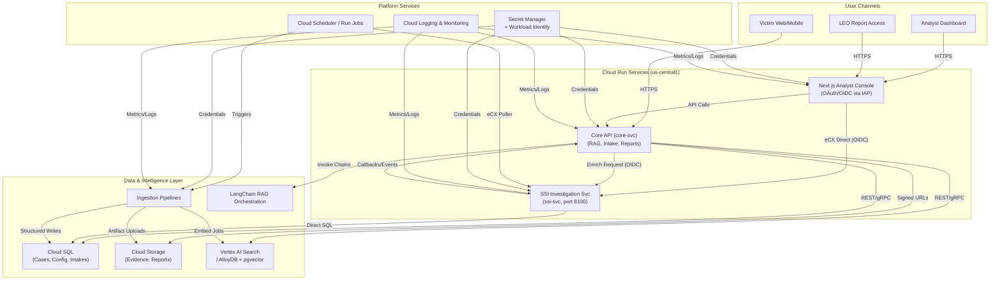
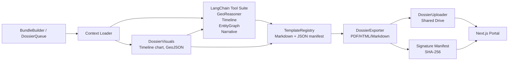

# i4g System Architecture

> **Document Version**: 2.2
> **Last Updated**: 2026-03-20
> **Last Verified**: 2026-03-20
> **Audience**: Engineers, technical stakeholders, university partners

---

## Executive Summary

**i4g** is a cloud-native, AI-powered platform that helps scam users document fraud and generate law enforcement reports. The system uses a **privacy-by-design** architecture where victim contact information is encrypted at the intake layer and investigation entities are stored in cleartext for analysis.

The **Next.js analyst console** on Cloud Run serves victims, volunteer analysts, and law enforcement officers through server-side proxy routes that preserve the privacy guarantees described below.

**Key Design Principles**:

1. **Privacy by Design**: Victim contact fields are encrypted; investigation entities remain in cleartext
2. **Serverless**: Zero budget constraint drives Cloud Run deployment
3. **Scalability**: Handles 20 concurrent users on GCP free tier
4. **Security**: AES-256-GCM encryption, OAuth 2.0, database RBAC

## Guiding Objectives

- **Extend and differentiate**: Extend the platform with capabilities differentiated from the Azure starting point — deeper privacy controls (PII vault), richer analytics (TIFAP, fraud taxonomy), and automated investigation (SSI).
- **Open-first**: Prefer open protocols/OSS-aligned services and keep clean swap points (Vertex ↔ pgvector, Gemini ↔ Ollama).
- **Operate light**: Favor repeatable runbooks and Workload Identity over long-lived keys so small teams can maintain it.
- **Privacy by design**: Victim intake encryption, victim-contact redaction in case text, and audit-logged decryption.
- **Cost-aware**: Stay within free-tier/nonprofit credits; degrade gracefully to local mocks when managed services are off.

## Deployment Profiles (Managed vs Local)

| Capability / Service     | Managed (Cloud Run / GCP)                             | Local / Laptop Profile                                        | Swap Mechanism                                                                                                                    |
| ------------------------ | ----------------------------------------------------- | ------------------------------------------------------------- | --------------------------------------------------------------------------------------------------------------------------------- |
| Identity                 | Google Cloud Identity Platform (OIDC)                 | Local mock OIDC provider or stub JWT signer for development   | `settings.identity.provider` (`google_identity`, `authentik`, `firebase`, `dev_stub`); toggle via `I4G_ENV` + `.env.local`.       |
| Core API (core-svc)      | Cloud Run service with Workload Identity              | Docker container running FastAPI with `.env` config           | `settings.runtime.mode` (`managed` / `local`); `make run-api` uses local profile.                                                 |
| Analyst UI               | Next.js on Cloud Run (authenticated via IAP)          | Next.js console run locally with dev auth toggles             | `pnpm --filter web dev`; configure `I4G_API_URL` + `I4G_API_KEY`.                                                                 |
| Retrieval & Vector Store | Vertex AI Search (default)                            | Dockerized Postgres + pgvector or local Chroma / FAISS        | `settings.vector.backend` (`vertex_ai`, `pgvector`, `chroma`, `faiss`); hot-swappable through `VectorStore` (`i4g.store.vector`). |
| LLM Inference            | Vertex AI Gemini 2.5 Flash                            | Ollama running locally or mock responses                      | `settings.llm.provider` (`vertex_ai`, `ollama`, `mock`); pluggable via `build_fraud_classifier()` in `factories.py`.              |
| Storage                  | Cloud SQL + Cloud Storage buckets                     | Local SQLite + filesystem folders                             | `settings.storage.structured_backend` (`sqlite`, `cloudsql`); mounts via `.env.local` paths.                                      |
| Ingestion Jobs           | Cloud Run Jobs + Scheduler                            | Local scripts invoked via `make ingest-*` with stub schedules | `scripts/ingest/*` honour `settings.jobs.enabled`; local cron disabled by default.                                                |
| Observability            | Cloud Logging/Monitoring with OpenTelemetry exporters | Console logs + optional local OTLP collector (Docker)         | `settings.telemetry.otlp_endpoint`; default empty routes to stdout.                                                               |
| Secrets                  | Secret Manager, Workload Identity                     | `.env.local` (gitignored) + Pydantic overrides                | `settings.secrets.provider` (`secret_manager`, `env`); helper resolves per environment.                                           |

> The managed and local profiles share the same configuration contract, so swapping between environments is a matter of
> setting `I4G_ENV` and the relevant overrides. A sample Docker Compose bundle will accompany Milestone 3 to spin up
> pgvector, Chroma, or Ollama when testing offline parity.

## Configuration Strategy

- Central `settings` package built on Pydantic BaseSettings loads defaults, then environment-specific config, then
  developer overrides. Always fetch via `i4g.settings.get_settings()` so Workload Identity/env overrides take effect.
- `I4G_ENV` selects `local`, `dev`, or `prod` with this stack order: baked-in defaults → env-specific config files
  (`config/settings.*.toml`) → `.env.local` (gitignored) → env vars (`I4G_*`, double underscores for nesting).
- Managed environments resolve secrets from Secret Manager; local profile falls back to `.env.local` to avoid accidental
  writes to production resources.
- Services share the same configuration contract so API, UI, jobs, and notebooks stay in sync. Local profile enables
  mock identity, SQLite structured store, Chroma vectors, Ollama LLM, Secret Manager disabled, and scheduled jobs off.

---

## High-Level Architecture

This section merges the previously archived future-state plan into the active architecture view so the diagrams and
component descriptions stay in one place.

### Future-State Topology



### Storage Architecture

For a detailed breakdown of the storage backends (Relational, Document, Vector, Blob) and how they differ between Local Sandbox and Cloud Dev environments, see the [Storage Architecture Guide](storage.md).

### Cloud Run Deployment Swimlanes

```mermaid
flowchart LR
  subgraph Users["User Entrypoints"]
    VictimUI[Victim Web/Mobile]
    AnalystUI[Analyst Portal]
    LEOUI[LEO Portal]
  end

  subgraph Edge["Identity & Edge"]
    IAP[Identity Platform / IAP]
  end

  subgraph RunServices["Cloud Run Services"]
    CoreSvc[Core API]
    NextJS[Next.js Console]
    SSISvc[SSI Investigation Service]
    JobIngest[Cloud Run Jobs - Ingestion]
    JobReport[Cloud Run Jobs - Report Generator]
  end

  subgraph VPC["Serverless VPC Access"]
    VPCConn[Serverless VPC Connector]
  end

  subgraph DataPlane["Data Plane & Private Services"]
    CloudSQL[Cloud SQL]
    Storage[Cloud Storage]
    Vector["Vector Store (Vertex AI Search / AlloyDB)"]
    KMS[Cloud KMS]
  end

  subgraph Platform["Platform Operations"]
    Secrets[Secret Manager]
    Logging[Cloud Logging / Monitoring]
    Scheduler[Cloud Scheduler]
  end

  VictimUI --> IAP
  AnalystUI --> IAP
  LEOUI --> IAP

  IAP --> CoreSvc
  IAP --> NextJS

  NextJS -->|Authenticated API| CoreSvc
  NextJS -->|eCX Direct (OIDC)| SSISvc
  CoreSvc -->|Enrich Request (OIDC)| SSISvc
  SSISvc -->|Callbacks/Events| CoreSvc
  SSISvc -->|Direct SQL| CloudSQL
  CoreSvc -->|REST| CloudSQL
  CoreSvc -->|Signed URLs| Storage
  CoreSvc -->|Vector Queries| Vector

  JobIngest -->|Writes| CloudSQL
  JobIngest -->|Artifacts| Storage
  JobIngest -->|Embeddings| Vector

  JobReport -->|Reads| CloudSQL
  JobReport -->|Publishes| Storage

  Scheduler -->|eCX Poller| SSISvc

  Secrets -.-> CoreSvc
  Secrets -.-> NextJS
  Secrets -.-> SSISvc
  Secrets -.-> JobIngest
  Secrets -.-> JobReport

  CoreSvc -.->|Workload Identity| VPCConn
  SSISvc -.->|Private Resources| VPCConn
  JobIngest -.->|Private Resources| VPCConn
  JobReport -.->|Private Resources| VPCConn

  VPCConn -->|Private Access| Vector
  VPCConn -->|Private Access| KMS

  Logging -.-> CoreSvc
  Logging -.-> NextJS
  Logging -.-> SSISvc
  Logging -.-> JobIngest
  Logging -.-> JobReport
```

The swimlanes emphasize the Cloud Run deployment boundary: Identity-Aware Proxy fronts the stateless Core API and
Next.js services, while background Cloud Run jobs handle ingestion and reporting. Workload Identity supplies secrets
from Secret Manager, and the shared VPC connector enables private access to the vector store or KMS when those
resources require it. Observability remains centralized through Cloud Logging and Monitoring across all containers.

### Current Logical Layout

```
┌──────────────────────────────────────────────────────────┐
│                      User Layer                          │
│  ┌──────────┐      ┌──────────┐      ┌──────────┐        │
│  │  User    │      │ Analyst  │      │   LEO    │        │
│  └────┬─────┘      └────┬─────┘      └────┬─────┘        │
└───────┼─────────────────┼─────────────────┼──────────────┘
        │                 │                 │
        │ HTTPS           │ HTTPS           │ HTTPS
        │                 │                 │
┌───────┼─────────────────┼─────────────────┼──────────────┐
│       │     GCP Cloud Run (us-central1)   │              │
│  ┌────▼─────────────────▼─────────────────▼────┐         │
│  │         Load Balancer (HTTPS / IAP)         │         │
│  └──┬─────────────────────┬────────────────────┘         │
│     │                     │                              │
│  ┌──▼─────────┐      ┌────▼──────────┐  ┌─────────────┐  │
│  │  FastAPI   │      │  Next.js      │  │  SSI Svc    │  │
│  │  Backend   │◄────►│  Analyst   ───┼──►  (Python,   │  │
│  │  (Python)  │      │  Console      │  │  port 8100) │  │
│  └──┬────┬────┘      └────┬──────────┘  └──────┬──────┘  │
│     │    └─ enrich/callbacks ───────────────────┘        │
│     │        Next.js ──► SSI = eCX direct (OIDC)         │
└─────┼──────────────────────┼─────────────────────────────┘
      │   Cloud SQL API      │
      │                      │
┌─────▼──────────────────────▼─────────────────────────────┐
│                  Data Layer (GCP)                        │
│  ┌──────────────┐  ┌────────────┐  ┌───────────┐  ┌────────────┐
│  │  Cloud SQL   │  │   Cloud    │  │  Secret   │  │ Vertex AI  │
│  │ (PostgreSQL) │  │  Storage   │  │  Manager  │  │  Search    │
│  └──────┬───────┘  └────────────┘  └───────────┘  └────────────┘
└─────────┼────────────────────────────────────────────────┘
          │
          │  Cloud SQL (ingestion + entity tables)
          │
┌─────────▼────────────────────────────────────────────────┐
│                 Dual Extraction Indexes                  │
│  ┌──────────────┐    ┌───────────────┐                   │
│  │ Cloud SQL /  │    │ Vertex AI     │                   │
│  │ AlloyDB      │    │ Search Corpus │                   │
│  └──────────────┘    └───────────────┘                   │
└─────────┬────────────────────────────────────────────────┘
          │
          │ HTTP (localhost:11434)
          │
┌─────────▼────────────────────────────────────────────────┐
│               External Services                          │
│  ┌──────────────┐    ┌────────────┐                      │
│  │    Ollama    │    │  SendGrid  │                      │
│  │  LLM Server  │    │   Email    │                      │
│  └──────────────┘    └────────────┘                      │
└──────────────────────────────────────────────────────────┘
```

### Dossier Flow — Agentic Evidence Dossiers

This section documents the architecture and data-flow for evidence dossier generation and distribution. It is intended as a stable, long-lived reference for engineers and reviewers.

- Source diagram (editable): https://drive.google.com/drive/folders/1z7pg_D0k6fiRQdw_pejeDBav49xdvnqL?usp=drive_link
- Local draw.io version: `docs/diagrams/dossier_flow.drawio` (importable into diagrams.net)
- Local mermaid snapshot mirrors the Drive version for offline readers.



---

## Component Architecture

### 1. **FastAPI Backend**

**Responsibilities**:

- REST API endpoints for case management
- Victim intake encryption
- LLM-powered scam classification
- Authentication (OAuth 2.0 JWT validation)
- Cloud SQL CRUD operations

**Technology Stack**:

- Python 3.11
- FastAPI 0.104+ (async/await support)
- LangChain 0.2+ (RAG pipeline)
- google-cloud-storage (file uploads)
- cryptography (AES-256-GCM encryption)

**Key Endpoints (FastAPI Routers)**:

| Prefix                     | Router            | Description                                             |
| -------------------------- | ----------------- | ------------------------------------------------------- |
| `/reviews`                 | `review.py`       | Search, queue ops, saved-search CRUD, review actions    |
| `/cases`                   | `cases.py`        | Case detail view (GET /cases/{id})                      |
| `/intakes`                 | `intake.py`       | Victim submission pipeline (contact fields encrypted)   |
| `/reports`                 | `reports.py`      | Dossier listing, artifacts, signature verification      |
| `/analytics`               | `analytics.py`    | Overview metrics, trends, intake stats                  |
| `/dashboard`               | `dashboard.py`    | Overview stats (active investigations, recent actions)  |
| `/campaigns`               | `campaigns.py`    | Fraud campaign CRUD                                     |
| `/discovery`               | `discovery.py`    | Vertex AI Discovery search                              |
| `/taxonomy`                | `taxonomy.py`     | Fraud taxonomy hierarchy tree                           |
| `/tasks/{task_id}`         | `app.py`          | Background task status polling                          |
| `POST /reports/generate`   | `app.py`          | Guarded report generation trigger                       |
| `/intelligence`            | `intelligence.py` | Graph, watchlist, chart sharing, entity/indicator views |
| `/feeds`                   | `partner_feed.py` | Partner indicator feed (API key auth, rate limited)     |
| `/cases/{id}/lea-referral` | `cases.py`        | LEA referral tracking (create/read)                     |

---

### 2. **Experience Layer**

#### Next.js External Portal

**Responsibilities**:

- Orchestrate the full victim → analyst → law enforcement workflow with OAuth-backed authentication
- Expose search, review, approval, and report delivery experiences through a React UI that mirrors the FastAPI contracts
- Render case detail pages with evidence thumbnails, inline entity highlighting, and Discovery powered search facets
- Provide bulk report exports, smoke-test hooks, and future citizen-facing intake forms without revealing backend secrets

**Technology Stack**:

- Node.js 20 (Cloud Run)
- Next.js 15 App Router with React 19 RC and TypeScript
- Tailwind CSS, `@i4g/ui-kit`, and shared design tokens
- `@i4g/sdk` with an adapter selected via `I4G_API_KIND` (core vs mock)

**Key Features**:

- Hybrid rendering (Server Components + edge-ready client interactivity)
- Cloud Run friendly build (PNPM workspaces, multi-stage Dockerfile)
- API route proxy that injects server-only secrets for FastAPI calls
- Configurable mock mode for demos without backend dependencies

---

### 2b. **SSI Investigation Service (ssi-svc)**

**Responsibilities**:

- Browser-automated scam site investigation using Playwright and zendriver (headless Chromium).
- Receives enrichment requests from `core-svc` and triggers a full investigation pipeline.
- Pushes structured investigation results back to `core-svc` via HTTP callbacks (`HttpEventSink`) and creates case records (`push_to_core`).
- Periodically polls for analyst guidance via `GuidancePollRelay`.
- Independently polls eCX (external exchange) data via Cloud Scheduler (`ssi-ecx-poller`, every 15 minutes).

**Technology Stack**:

- Python 3.11, FastAPI (port 8100), Playwright + zendriver for browser automation
- Gemini 2.5 Flash for on-page intelligence extraction
- Cloud Run service, separate from `core-svc` to isolate Chromium resource use and sandbox browser risk

**Integration Points**:

| Direction        | Mechanism                                    | Endpoint / Contract                             |
| ---------------- | -------------------------------------------- | ----------------------------------------------- |
| Core → SSI       | `POST {ssi.service_url}/trigger/investigate` | OIDC auth, httpx 30s timeout                    |
| SSI → Core       | `HttpEventSink` (live events)                | `POST /cases/{id}/events` on core-svc           |
| SSI → Core       | `push_to_core` (case creation)               | `POST /cases` on core-svc                       |
| SSI → Core       | `GuidancePollRelay` (analyst cmds)           | `GET /cases/{id}/guidance` polled by SSI        |
| UI → SSI (eCX)   | Direct HTTP via Next.js proxy                | `SSI_API_URL` env var, Cloud Run OIDC token     |
| UI → SSI (invst) | Routed through core-svc                      | core-svc is the orchestrator for investigations |

See `planning/architecture/integration_contracts.md` for the full contract specification.

---

### 3b. **Dual Extraction Ingestion Pipeline**

**Responsibilities**:

- Normalize Discovery bundles into structured case/entity payloads (`ingest_payloads.prepare_ingest_payload`).
- Execute `i4g.worker.jobs.ingest`, which orchestrates entity extraction, SQL writes (`SqlWriter`), and Vertex AI Search document imports (`VertexWriter`).
- Persist ingestion run metrics plus retry payloads so operators can audit progress (`IngestionRunTracker`) and replay failed Vertex batches via `i4g.worker.jobs.ingest_retry`.

**Technology Stack**:

- Python workers launched locally or via Cloud Run jobs using `conda run -n i4g python -m i4g.worker.jobs.{ingest,ingest_retry}`.
- Cloud SQL / SQLite for `cases`, `entities`, and `ingestion_runs`; Vertex AI Search (`retrieval-poc`) for semantic retrieval.
- Settings-driven toggles (`I4G_VERTEX_SEARCH_*`, `I4G_INGEST_RETRY__BATCH_LIMIT`) resolved by `i4g.settings.get_settings()` so environment overrides stay declarative.

**Key Features**:

- Run tracking (`scripts/verify_ingestion_run.py`) records case/entity counts plus backend-specific write totals, enabling reproducible smokes across local/dev/prod.
- `_maybe_enqueue_retry` serializes the SQL result + payload + error, allowing the retry worker to rehydrate the exact Vertex writes without repeating entity extraction.
- Retry worker operates in dry-run or live mode, reporting successes/failures per backend; batches can be tuned to stay under rate limits.

**Operational Status (Nov 30, 2025)**:

- Dev ingestion run `01993af5-09ab-4ecf-b0c8-cd86702b8edd` processed 200 `retrieval_poc_dev` cases with SQL reaching 200 writes; Vertex imported 155 documents before hitting the "Document batch requests/min" quota (HTTP 429 ResourceExhausted).
- `python -m i4g.worker.jobs.ingest_retry` (batch size 10) drained the 45 queued Vertex payloads once quota recovered, so the corpus is eventually consistent even when the live run throttles.
- Until the Vertex quota is raised, operators should stagger ingestion batches (e.g., lower ingestion job batch sizes) or schedule retry workers immediately after large ingests to finish the semantic index.

---

### 3. **Cloud SQL Database**

The relational schema is defined in SQLAlchemy models at `src/i4g/store/sql.py` and managed via Alembic migrations (`alembic/` directory). Key tables:

| Table Group     | Tables                                                     | Notes                                                                      |
| --------------- | ---------------------------------------------------------- | -------------------------------------------------------------------------- |
| Core case data  | `cases`, `scam_records`, `entities`                        | Normalized case + extracted entity storage                                 |
| Review workflow | `review_queue`, `review_actions`                           | Analyst queue assignments and audit trail                                  |
| Intake pipeline | `intake_records`, `ingestion_runs`, `ingestion_retry`      | Victim submissions (contact fields encrypted) and batch ingestion tracking |
| Classification  | `classifications`, `campaigns`, `campaign_classifications` | Fraud taxonomy and campaign linkage                                        |
| Audit           | `audit_log`                                                | Victim-contact decryption access log                                       |
| Evidence        | `source_documents`, `evidence_files`                       | Document metadata and artifact references                                  |

**Access Control**:

Row-level security and role-based access are enforced at the application layer via Cloud SQL IAM database authentication and PostgreSQL roles:

- Analysts can only read cases assigned to them (filtered by `assigned_to` column matching authenticated user).

````

---

### 4. **TIFAP — Threat Intelligence & Fraud Analytics Platform**

TIFAP is **not a separate service** — it is a subsystem within `core-svc` that reads from core's data stores using SQLAlchemy directly (no HTTP hop).

**Responsibilities**:

- Aggregates case and entity data to detect fraud campaigns (entity clustering, wallet graph traversal, timeline analysis).
- Exposes graph service, watchlist management, and partner indicator feeds via `core-svc` API routes (`/intelligence`, `/feeds`).
- Blockchain analytics enrichment: wallet labels, risk scores, cluster edges.
- External enrichment integration: passive DNS, ASN lookup, takedown verification.

**Key Fact**: TIFAP reads from core data at query time, not through a separate pipeline or scheduled job. The `/intelligence` router and `/feeds` router in `core-svc` are the TIFAP surface.

---

### 5. **PII Vault — Cross-Cutting Privacy Layer**

The PII vault is an application-layer encryption facility that protects victim contact data across all flows.

**Principle**: Investigation entities (wallet addresses, email addresses extracted from case narratives) remain in cleartext for analysis. Victim contact information (reporter name, email, phone, handle) is Fernet-encrypted before any database write.

**Architecture**:

| Layer          | Behavior                                                                     |
| -------------- | ---------------------------------------------------------------------------- |
| Intake write   | `intake.py` Fernet-encrypts contact fields before SQL write                  |
| Storage        | `intake_records` table holds ciphertext; `cases` table holds cleartext entities |
| Authorized read | Explicit decrypt endpoint; logs actor, timestamp, justification to `audit_log` |
| Key storage    | `I4G_CRYPTO__PII_KEY` in Secret Manager; scheduled rotation via Cloud Scheduler |
| Ingestion      | Victim contact info is redacted from case text before vector embedding       |

See [PII Vault Design](pii_vault.md) for the complete specification including key rotation and the dual-key re-encryption procedure.

---

### 6. **LLM Inference**

The platform supports three LLM providers, selectable via `settings.llm.provider`:

| Provider | Setting Value | Model | Use Case |
|----------|---------------|-------|----------|
| Vertex AI Gemini | `vertex_ai` | `gemini-2.5-flash` via `google-cloud-aiplatform` | Cloud / production inference |
| Ollama | `ollama` | `llama3` (default, configurable) | Local development on developer laptops |
| Mock | `mock` | Deterministic canned responses | Unit tests and CI pipelines |

**Responsibilities**:
- Scam classification (romance, crypto, phishing, other)
- Summarization and report narrative generation

Provider selection and model construction are handled by `build_fraud_classifier()` in `src/i4g/services/factories.py`.

---

## End-to-End Data Flows

### Victim Intake → Structured Storage
1. Victim submits a report via FastAPI intake (optionally authenticated through Google Identity or other OIDC provider).
2. FastAPI encrypts victim contact fields (reporter name, email, phone, handle) using Fernet before the database write.
3. LLM classification annotates the case with scam type/confidence.
4. Normalized case metadata writes to Cloud SQL tables (`cases`, `case_events`, `attachments`).
5. Evidence artifacts upload to Cloud Storage using pre-signed URLs; completion webhooks update Cloud SQL metadata with
  checksum, MIME type, and retention tags.

### Retrieval-Augmented Chat & Search
1. Analyst initiates a search session in the Next.js console; the frontend calls FastAPI (`/reviews/search` or `/discovery`) with question, filters, and
  auth context.
2. FastAPI fetches structured context (case ownership, tags, status) from Cloud SQL based on analyst permissions.
3. LangChain pipeline embeds the question (Vertex AI Embeddings or environment-specified model) and queries the
  configured vector backend.
4. Vector backend (Vertex AI Search or AlloyDB + pgvector) returns top-k documents; pipeline de-duplicates, scores, and
  enriches with structured fields.
5. Prompt assembly blends structured metadata, vector hits, and policy disclaimers before invoking the configured LLM.
6. Responses persist to Cloud SQL audit tables; optional feedback flows back into the vector store for continual
  improvement.

### Accepted Review → Report Generation
1. Review status transition to `accepted` emits an event (database trigger or manual CLI) that queues a report task.
2. Worker resolves the review via `ReviewStore`, gathering entities, transcripts, evidence references, and analyst notes
  using the settings-backed store factories.
3. `ReportGenerator` fetches related cases via the vector store and runs LangChain summarization through the configured LLM provider.
4. `TemplateEngine` renders Markdown → DOCX/PDF; exporter writes artifacts to Cloud Storage (`i4g-reports-*`) with
  signature manifest updates.
5. Notifications (email/SMS) can be dispatched by a Cloud Run job using Secret Manager credentials; signed URLs are
  returned to the console and logged for audit.
6. Audit trail in Cloud SQL captures status, actor, and checksums for compliance review.

### Victim Contact Encryption (developer reference)

See `docs/design/pii_vault.md` for the full design. Victim contact fields (reporter name, email, phone, handle) are
Fernet-encrypted on intake write and decrypted on authorized read. Investigation entities (wallets, emails from case
narratives) remain in cleartext. Victim contact info is redacted from case text during ingestion.

---

## Deployment Architecture

### GCP Free Tier Strategy

| Service | Free Tier | Estimated Usage | Cost |
|---------|-----------|-----------------|------|
| Cloud Run | 2M requests/month | 100K requests/month | $0 |
| Cloud SQL | Free-tier eligible | Shared instance | $0 |
| Cloud Storage | 5 GB | 2 GB (evidence files) | $0 |
| Cloud Logging | 50 GB/month | 10 GB/month | $0 |
| Secret Manager | 6 active secrets | 3 secrets | $0 |

**Total Monthly Cost**: **$0** (within free tier limits)

**Scaling Trigger**: If usage exceeds free tier, apply for:
1. Google for Nonprofits ($10K/year credits)
2. AWS Activate ($5K credits)
3. NSF SBIR grant ($50K)

---

### Cloud Run Configuration

API deployment (Python FastAPI):

```bash
gcloud run deploy i4g-api \
  --image us-central1-docker.pkg.dev/i4g-dev/applications/core-svc:dev \
  --region us-central1 \
  --platform managed \
  --allow-unauthenticated \
  --service-account i4g-backend@i4g-prod.iam.gserviceaccount.com \
  --max-instances 10 \
  --memory 1Gi \
  --timeout 300 \
  --set-env-vars "ENVIRONMENT=production" \
  --set-secrets "TOKEN_ENCRYPTION_KEY=TOKEN_ENCRYPTION_KEY:latest"
````

Analyst console deployment (Next.js container image built via PNPM workspaces):

```bash
gcloud run deploy i4g-console \
    --image us-central1-docker.pkg.dev/i4g-dev/applications/analyst-console:dev \
    --region us-central1 \
    --platform managed \
    --allow-unauthenticated \
    --set-env-vars NEXT_PUBLIC_USE_MOCK_DATA=false \
    --set-env-vars I4G_API_URL=https://core-svc-y5jge5w2cq-uc.a.run.app/ \
    --set-env-vars I4G_API_KIND=core \
    --set-env-vars I4G_API_KEY=dev-analyst-token
```

**Auto-Scaling**:

- Minimum instances: 0 (scales to zero when idle)
- Maximum instances: 10 (free tier limit)
- Concurrency: 20 requests per instance
- Cold start time: ~3 seconds

---

## Security Architecture

This section now embeds the future-state IAM and control-plane details; `docs/design/iam.md` remains the procedural source of
truth.

### Identity & Access Control

- Primary option: Google Cloud Identity Platform (OIDC) with role claims for `victim`, `analyst`, `admin`, and `leo`.
- Fallback / future option: authentik or Keycloak on Cloud Run or GKE if self-hosted control becomes necessary.
- The Next.js console and FastAPI share a lightweight auth service for token verification and role enforcement; all user entry
  points are fronted by Identity-Aware Proxy.
- Service-to-service authentication relies on service account identities and Workload Identity Federation; no
  long-lived API keys.
- Local development uses short-lived signed JWTs from a dev helper to mimic IdP-issued tokens and exercise role paths.

### Service Accounts & Permissions

| Component                                  | Service Account       | Key Roles                                                                                                                                                              |
| ------------------------------------------ | --------------------- | ---------------------------------------------------------------------------------------------------------------------------------------------------------------------- |
| FastAPI Cloud Run service                  | `sa-app@{project}`    | `roles/run.invoker`, `roles/datastore.user`, `roles/storage.objectViewer`, custom `roles/vertex.searchUser` or AlloyDB client role, Secret Manager accessor            |
| Next.js analyst console                    | `sa-app@{project}`    | `roles/run.invoker`, `roles/datastore.viewer`, `roles/storage.objectViewer`, `roles/logging.logWriter`, custom Discovery search role, Secret Manager accessor          |
| Ingestion jobs / schedulers                | `sa-ingest@{project}` | `roles/run.invoker`, `roles/storage.objectAdmin`, `roles/datastore.user`, Pub/Sub publisher when workflows emit events, Secret Manager accessor for source credentials |
| Report worker (Cloud Run job or scheduler) | `sa-report@{project}` | `roles/storage.objectAdmin`, `roles/datastore.user`, Secret Manager accessor                                                                                           |
| Terraform / automation pipeline            | `sa-infra@{project}`  | `roles/resourcemanager.projectIamAdmin`, `roles/run.admin`, `roles/storage.admin`, `roles/iam.securityReviewer` scoped to the infra project                            |

> Discovery access is granted via a custom IAM role that wraps `discoveryengine.servingConfigs.search`; Terraform
> provisions it per project to avoid unsupported project-level grants.

### Secrets & Encryption

- Secret Manager holds database passwords, third-party API keys, and the Fernet PII key (`I4G_CRYPTO__PII_KEY`); access
  is scoped to the runtime service accounts above.
- Victim contact fields are Fernet-encrypted at the application layer before database write; the key lives in Secret
  Manager with scheduled rotation.

### Network & Data Safeguards

- VPC Access connectors back Cloud Run services for outbound calls to private resources (Cloud SQL, AlloyDB, KMS).
- Cloud Storage buckets enforce uniform bucket-level access with IAM conditions; signed URLs have short TTLs and carry
  user identity in audit logs.
- Database RBAC mirrors server-side checks for per-row ownership and role-based access.
- Artifact Registry images are signed (Sigstore) and verified by Cloud Deploy prior to promotion.

### Monitoring & Compliance

- Cloud Audit Logs retained for ≥400 days; exports land in BigQuery or Cloud Storage coldline when costs allow.
- Security Command Center (Standard) feeds vulnerability findings on Cloud Run images and IAM misconfigurations.
- Daily job reconciles IAM policy drift against Terraform state and alerts via Cloud Monitoring.
- Incident response playbook covers Secret Manager rotation and encrypted-field key rotation; access transparency
  reports are stored alongside audit exports.

### Role-to-Capability Matrix

| Role                            | Entry Path                                   | Primary Data Access                                                                                                 | Actions Allowed                                                                         | Notes                                                                      |
| ------------------------------- | -------------------------------------------- | ------------------------------------------------------------------------------------------------------------------- | --------------------------------------------------------------------------------------- | -------------------------------------------------------------------------- |
| Victim                          | FastAPI intake endpoints via Google Identity | Own submissions (Cloud SQL rows scoped to UID), upload bucket objects via signed URL                                | Create/update intake records, upload evidence, read status of submitted cases           | Read-only access enforced through database RBAC; no direct Storage listing |
| Analyst                         | Next.js analyst console (Cloud Run)          | Case queues, evidence metadata, vector query results; victim contact info available via authorized decrypt endpoint | Claim/release cases, run chat/RAG searches, trigger report generation, annotate cases   | Contact decryption requires explicit action and logs actor/justification   |
| Admin                           | Next.js admin views + FastAPI admin APIs     | All case data, configuration collections, audit logs                                                                | Manage users/roles, adjust configuration, approve report publishing, initiate rotations | Access gated by admin-only OAuth claim and Cloud Run IAM                   |
| Law Enforcement (LEO)           | Next.js read-only report portal              | Published reports, supporting evidence with signed URLs                                                             | View/download reports, acknowledge receipt                                              | Accounts provisioned manually; multi-factor auth enforced                  |
| Automation (ingest/report jobs) | Cloud Run jobs / Scheduler                   | Cloud SQL ingestion tables, Storage evidence buckets, vector store                                                  | Normalize raw feeds, enqueue cases, seed vector index, emit alerts                      | Operate under dedicated service accounts with least privilege              |

### PII Isolation

```
┌─────────────────────────────────────────────────────┐
│                  Untrusted Zone                     │
│  ┌────────────┐         ┌────────────┐              │
│  │ User Input │   -->   │ API Layer  │              │
│  └────────────┘         └──────┬─────┘              │
└────────────────────────────────┼────────────────────┘
                                 │
                       ┌─────────▼─────────┐
                       │  Intake Service   │
                       │  Fernet-encrypts  │
                       │  contact fields   │
                       └─────────┬─────────┘
                                 │
              ┌──────────────────┼──────────────────┐
              │                                     │
    ┌─────────▼────────┐               ┌────────────▼────────┐
    │  intake_records  │               │   Cases DB          │
    │  (contact fields │               │  (cleartext         │
    │   encrypted)     │               │   entities)         │
    │  Cloud SQL       │               │  Cloud SQL          │
    └──────────────────┘               └──────────┬──────────┘
                                                   │
                                         ┌────────▼──────────┐
                                         │ Next.js Analyst   │
                                         │ Console (victim   │
                                         │ contact redacted) │
                                         └───────────────────┘
```

---

### 3. **Encryption**

**At Rest**:

- **Cloud SQL**: Encryption at rest (Google-managed keys)
- **Cloud Storage**: Customer-Managed Encryption Keys (CMEK)
- **Intake Records**: Fernet encryption for victim contact fields (app-level)

**In Transit**:

- **All API calls**: TLS 1.3
- **Cloud Run**: HTTPS only (HTTP redirects to HTTPS)
- **Ollama**: HTTP localhost (same machine, no network)

**Key Management**:

```bash
# Encryption key stored in Secret Manager
gcloud secrets create TOKEN_ENCRYPTION_KEY \
  --data-file=<(python -c 'from cryptography.fernet import Fernet; print(Fernet.generate_key().decode())')

# Monthly key rotation (automated via Cloud Scheduler)
gcloud secrets versions add TOKEN_ENCRYPTION_KEY --data-file=new_key.txt
```

---

## Monitoring & Observability

### Structured Logging

```json
{
  "timestamp": "2025-10-30T12:00:00Z",
  "severity": "INFO",
  "correlation_id": "uuid-v4",
  "user_id": "analyst_uid_123",
  "action": "case_approved",
  "metadata": {
    "case_id": "uuid-v4",
    "classification": "Romance Scam",
    "confidence": 0.92
  }
}
```

---

### Custom Metrics

- **Request Rate**: `custom.googleapis.com/i4g/api_requests_per_second`
- **Contact Decryption**: `custom.googleapis.com/i4g/contact_decrypt_count`
- **Classification Accuracy**: `custom.googleapis.com/i4g/classification_accuracy`
- **LEO Reports Generated**: `custom.googleapis.com/i4g/reports_generated_count`

---

### Alerting Policies

1. **High Error Rate**: 5xx errors >5% for 5 minutes
2. **High Latency**: p95 latency >2 seconds for 5 minutes
3. **Contact Decryption Anomaly**: >100 decryptions per minute
4. **Free Tier Quota**: >80% of monthly quota used

---

## Performance Benchmarks

### Response Times (p95)

> TBD — benchmark against production endpoints. Key routes to measure:
>
> - `POST /reviews/search` (hybrid retrieval)
> - `GET /cases/{id}` (case detail with entity resolution)
> - `POST /reports/generate` (guarded report generation)
> - `POST /intakes` (victim submission with contact encryption)

### Throughput

- **Concurrent users**: 20 (tested with Locust)
- **Cases per day**: 50 (prototype usage)
- **LLM inference**: 5 tokens/second (Ollama on Cloud Run GPU)

---

## Disaster Recovery

### Backup Strategy

```bash
# Daily Cloud SQL backup (Cloud Scheduler cron job)
gcloud sql backups create --instance=i4g-prod-db \
  --description="daily-$(date +%Y%m%d)"

# Retention: 7 days
gsutil lifecycle set lifecycle.json gs://i4g-backups
```

**lifecycle.json**:

```json
{
  "lifecycle": {
    "rule": [
      {
        "action": { "type": "Delete" },
        "condition": { "age": 7 }
      }
    ]
  }
}
```

---

### Recovery Procedures

**Scenario 1: Accidental case deletion**

```bash
# 1. Find latest backup
gsutil ls gs://i4g-backups/

# 2. Restore from backup
gcloud sql backups restore BACKUP_ID --restore-instance=i4g-prod-db
```

**Scenario 2: Encrypted field key compromise**

```bash
# 1. Rotate the Fernet key in Secret Manager
gcloud secrets versions add I4G_CRYPTO__PII_KEY --data-file=new_key.txt

# 2. Re-encrypt intake records with the new key
i4g jobs re-encrypt-contacts

# 3. Disable the old key version
gcloud secrets versions disable OLD_VERSION --secret=I4G_CRYPTO__PII_KEY

# 4. Resume traffic
gcloud run services update i4g-api --traffic
```

---

## Technology Stack

### Backend

- **Language**: Python 3.11
- **Framework**: FastAPI 0.104+ (async, type hints)
- **ORM**: SQLAlchemy 2.0 + Alembic (migrations)
- **RAG Pipeline**: LangChain 0.2+ (LCEL composition)
- **LLM**: Vertex AI Gemini (cloud) / Ollama (local) / Mock (tests) — via `build_fraud_classifier()`
- **Vector DB**: Vertex AI Search (cloud) / ChromaDB or FAISS (local) — via `VectorStore`
- **OCR**: Tesseract + pytesseract for document text extraction

### Frontend

- **External portal**: Next.js 15 (victim, analyst, and law enforcement UI)
- **Shared styling**: Tailwind CSS design tokens + focused CSS for PII redaction and responsive layouts

### Cloud Infrastructure

- **Hosting**: Google Cloud Platform
  - Cloud Run (API + dashboard)
  - Cloud SQL (PostgreSQL)
  - Cloud Storage (file uploads)
  - Secret Manager (API keys, encryption keys)
  - Cloud Logging (structured logs)
  - Cloud Monitoring (metrics + alerts)

### CI/CD

- **Version Control**: GitHub
- **CI Pipeline**: GitHub Actions
  - Lint (black, isort, mypy)
  - Test (pytest, 80% coverage)
  - Build (Docker image)
  - Deploy (Cloud Run via gcloud CLI)

---

## Future Architecture Improvements

### Completed (formerly Phase 2)

- [x] Background task execution via `TASK_STATUS` dict + `asyncio` threads (interim until Redis)
- [x] Cloud Run Jobs for async work (ingestion, report generation, dossier assembly)
- [x] Multi-provider LLM support (Vertex AI, Ollama, Mock)

### Phase 2 (In Progress)

- [ ] Replace in-memory `TASK_STATUS` with Redis for multi-instance consistency
- [ ] CDN for static assets (Cloud CDN)
- [ ] Multi-region deployment (us-central1 + europe-west1)

### Completed (formerly Phase 2b — TIFAP Sprint 6)

- [x] Threat Intelligence & Fraud Analytics Platform (TIFAP) — aggregation pipeline, graph service, campaign intelligence
- [x] Partner indicator feed API with dedicated auth, rate limiting, and STIX/CSV export
- [x] Blockchain analytics enrichment (wallet labels, risk scores, cluster edges)
- [x] LEA referral tracking on case records
- [x] Mobile-responsive Impact Dashboard with KPI sparklines
- [x] Database index optimization for analytics queries (9 indexes added)
- [x] External enrichment services (passive DNS, ASN lookup, takedown verification)

### Phase 3 (Scale)

- [ ] Event-driven architecture (Pub/Sub)
- [ ] Real-time analytics dashboard (BigQuery + Data Studio)
- [ ] Mobile app (React Native)

---

## Questions & Support

- Maintainer: Jerry Soung (jerry.soung@gmail.com)
- Documentation: https://github.com/jsoung/i4g/tree/main/docs
- API Docs: https://api.i4g.org/docs

---

**Last Updated**: 2026-03-20<br/>
**Last Verified**: 2026-03-20<br/>
**Next Review**: 2026-06-20
