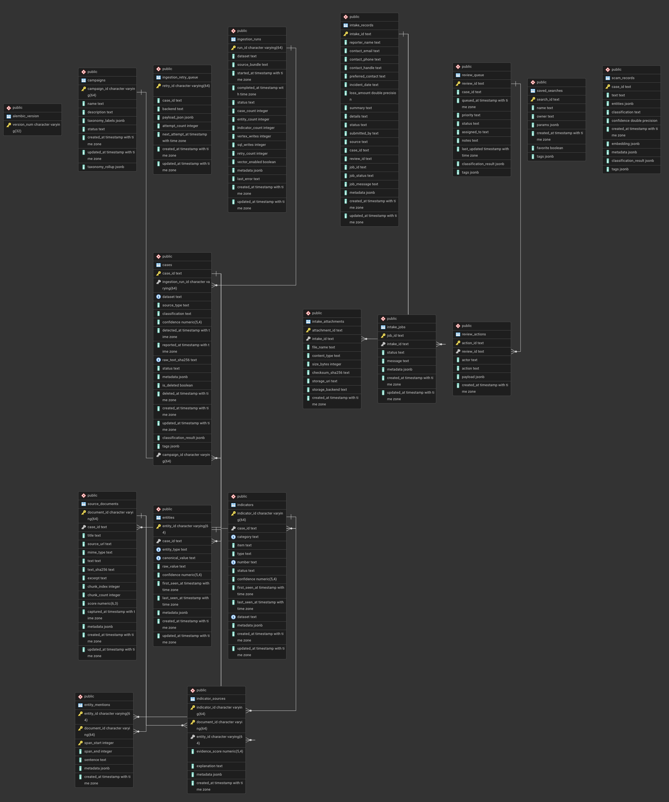

# Data Model

> **Status**: Draft
> **Last Updated**: January 7, 2026

This document outlines the database schema and entity relationships for the i4g core platform.

## ER Diagram

## Core Entities

The schema primarily supports:
- **Reviews**: Central workflow validation entities.
- **Tasks**: Async background processing units.
- **Audit Logs**: Compliance and history tracking.
