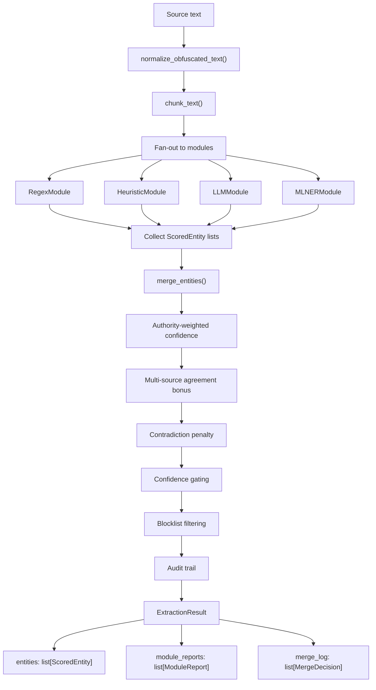

# Technical Design: Entity Extraction Pipeline

> **Status**: Active (v1.0)
> **Last Updated**: April 2026
> **Audience**: Engineers, technical stakeholders
> **PRD**: `planning/prd_entity_extraction_v2.md`

---

## Overview

The entity extraction pipeline replaces scattered extraction logic (inline LLM calls, duplicated merge
heuristics, hard-coded blocklists) with a modular, authority-ranked pipeline. Every entity in the
system flows through a single function: `extract_entities()`.

**Key properties:**

- **Single entry point** — all callers use `i4g.extraction.extract_entities()`
- **Pluggable modules** — new extraction strategies are added by implementing `ModuleProtocol`
- **Authority-ranked merge** — higher-authority modules' confidence counts more
- **Auditable** — every merge decision is recorded with action, reason, and source provenance
- **Configurable** — enabled modules, confidence gates, and blocklists are settings, not code
- **Resilient** — a failed module does not block the pipeline; partial results are returned

---

## Pipeline Flow



---

## Module System

### Module Protocol

Every extraction module implements `ModuleProtocol`:

| Property / Method | Type                 | Description                                  |
| ----------------- | -------------------- | -------------------------------------------- |
| `name`            | `str`                | Unique identifier (e.g., `"regex"`, `"llm"`) |
| `authority`       | `dict[str, float]`   | Per-entity-type authority weight in [0, 1]   |
| `extract(text)`   | `list[ScoredEntity]` | Run extraction on normalized text            |

### Module Capability Matrix

| Entity Type    |  Regex  | Heuristic |   LLM   | ML NER | Notes                               |
| -------------- | :-----: | :-------: | :-----: | :----: | ----------------------------------- |
| wallet_address | **1.0** |     —     |   0.7   |  0.6   | Regex is definitive (pattern-based) |
| email_address  | **1.0** |     —     |   0.7   |  0.6   | Regex is definitive                 |
| phone_number   | **1.0** |     —     |   0.7   |  0.6   | Regex is definitive                 |
| url            | **1.0** |     —     |   0.7   |  0.6   | Regex is definitive                 |
| bank_account   |   0.9   |     —     |   0.7   |  0.6   | Regex covers structured formats     |
| social_handle  |   0.9   |     —     |   0.7   |   —    | Regex covers @-prefixed handles     |
| person         |    —    |    0.4    | **0.8** |  0.7   | LLM primary; heuristic corroborates |
| organization   |    —    |     —     | **0.8** |  0.7   | LLM primary                         |
| scam_indicator |    —    |     —     | **0.8** |   —    | LLM only                            |
| location       |    —    |     —     |   0.7   |  0.7   | LLM + ML NER                        |
| crypto_token   |    —    |    0.4    |   0.7   |   —    | Keyword heuristic + LLM             |
| domain         |    —    |     —     |   0.7   |   —    | LLM only                            |

**Bold** = highest authority for that type. Dash = module does not cover that type.

### Module Details

**RegexModule** — Pattern-based extraction for technical entity types (wallets, emails, phones,
URLs, bank accounts, social handles). Confidence is 0.9 for all matches. Highest authority for
pattern-matchable types because regex has zero ambiguity.

**HeuristicModule** — Lightweight rules for person names (capitalized two-word patterns) and crypto
token keywords. Low authority (0.4) because both heuristics are noisy — they require corroboration
from LLM or ML NER to survive the merge.

**LLMModule** — Structured JSON extraction via LLM prompt (Ollama or Vertex AI). Primary source for
semantic entity types (person, organization, scam_indicator). Includes language detection for
non-English texts. Limited to 8,000 characters per call; larger documents are chunked.

**MLNERModule** — Named entity recognition via the ML platform's prediction API. Passes through
model confidence scores (not hard-coded). Requires an active ML serving endpoint.

**BlocklistModule** — Post-extraction filter, not a producer. Called during merge to drop known
false positives (e.g., "Wells Fargo" as person, "On Behalf" as person). Configured via
`config/entity_blocklist.toml`.

---

## Merge Algorithm

The merge engine (`merge.py`) transforms a flat list of `ScoredEntity` from all modules into a
deduplicated, quality-gated result with full provenance.

### Steps

1. **Group** — entities grouped by `(entity_type, canonical_value)`.

2. **Authority-weighted confidence** — for each group, compute:

   ```
   weighted = max(authority[source_module][entity_type] * confidence)
   ```

3. **Multi-source agreement bonus** — if 2+ modules found the same entity:

   ```
   weighted = min(1.0, weighted + 0.1 × (num_sources − 1))
   ```

4. **Contradiction penalty** — for each module with authority ≥ 0.7 for the type that ran
   successfully but did NOT find the entity:

   ```
   weighted *= 0.8
   ```

   Rationale: a high-authority module's silence is evidence against the entity.

5. **Confidence gating** — if `weighted < gate[entity_type]`, the entity is dropped. Default gate
   is 0.5. Per-type gates are configured in `settings.default.toml` (`gate_<type>` keys).

6. **Blocklist filtering** — if `blocklist.is_blocklisted(entity_type, canonical_value)`, the
   entity is dropped regardless of confidence.

7. **Emit** — surviving entities are marked KEPT (single source) or BOOSTED (multi-source). Each
   decision is recorded as a `MergeDecision` audit record.

### Constants

| Constant                    | Value | Purpose                                                      |
| --------------------------- | ----- | ------------------------------------------------------------ |
| `_AGREEMENT_BONUS`          | 0.1   | Added per additional agreeing source                         |
| `_CONTRADICTION_FACTOR`     | 0.8   | Multiplier when high-authority module is silent              |
| `_HIGH_AUTHORITY_THRESHOLD` | 0.7   | Authority level that triggers contradiction check            |
| `_DEFAULT_GATE`             | 0.5   | Fallback confidence gate when no per-type gate is configured |

### Why This Algorithm Works

The authority-ranked merge solves the core problem of earlier extraction: regex finding "Wells Fargo"
as a person name and no logic to override it. Now:

- Regex has **0.0 authority for person** (it doesn't produce person entities at all).
- LLM has **0.8 authority for person** — it correctly identifies "Wells Fargo" as an organization.
- The blocklist adds a safety net: even if a module misclassifies, known false positives are caught.
- The contradiction penalty suppresses entities that only one low-authority module finds.

---

## Text Pre-Processing

Before modules see the text, two transformations run:

### Obfuscation Normalization

Scammers obfuscate contact info to evade detection. The normalizer reverses:

| Technique          | Example                 | Normalized          |
| ------------------ | ----------------------- | ------------------- |
| Spaced characters  | `g o o g l e . c o m`   | `google.com`        |
| Separator words    | `john at gmail dot com` | `john@gmail.com`    |
| Bracket separators | `[at]` / `[dot]`        | `@` / `.`           |
| Leetspeak          | `g00gle`, `b1tc0in`     | `google`, `bitcoin` |

Leetspeak decoding only fires for known scam-related keywords (google, bitcoin, coinbase, etc.)
to avoid false positives on legitimate numeric strings.

### Large Document Chunking

Documents exceeding the LLM's context window are split on message boundaries (email thread
delimiters, paragraph breaks). Each chunk is extracted independently, then entities are
deduplicated across chunks. Span offsets are adjusted to reference the full original document.

---

## Callers

### Entity Extract Job (`worker/jobs/entity_extract.py`)

The batch extraction job queries the database for cases missing entities, fetches their source
document text, and calls `extract_entities()` for each case. Results are persisted to the
`entities` table (and `indicators` for threat infrastructure types). Supports `--backfill` and
`--limit` flags. Concurrency controlled by `extraction.batch_concurrency`.

### Ingest Payloads (`services/ingest_payloads.py`)

At ingest time, `prepare_ingest_payload()` calls `extract_entities(text, modules=["regex"])` as a
fast fallback when no pre-structured entities exist. Regex-only extraction provides immediate
entity availability without LLM latency. The full extraction job runs later to add semantic types.

---

## Configuration

All extraction settings live in `config/settings.default.toml` under `[extraction]`:

| Setting             | Default            | Description                                      |
| ------------------- | ------------------ | ------------------------------------------------ |
| `enabled_modules`   | `["regex", "llm"]` | Modules to run (also: `"heuristic"`, `"ml_ner"`) |
| `batch_concurrency` | `1`                | Parallel LLM calls in batch jobs                 |
| `llm_delay_seconds` | `0.5`              | Throttle between sequential LLM calls            |
| `gate_<type>`       | `0.4`–`0.6`        | Per-type confidence threshold                    |

Override via environment variables: `I4G_EXTRACTION__ENABLED_MODULES='["regex","llm","heuristic"]'`.

The blocklist is in `config/entity_blocklist.toml` — editable by non-engineers. Format:

```toml
[person]
values = ["Wells Fargo", "On Behalf", "United States"]
```

---

## Quality Assurance

The `i4g entity-qa` CLI provides a test harness for measuring extraction quality:

| Command                       | Purpose                                                   |
| ----------------------------- | --------------------------------------------------------- |
| `bundle list/download/create` | Manage labeled test bundles                               |
| `test module <name>`          | Run a single module on a bundle                           |
| `test orchestrator`           | Run full pipeline on a bundle                             |
| `compare`                     | Side-by-side module F1 comparison                         |
| `score`                       | Precision/recall/F1 per entity type against golden labels |
| `report`                      | Combined score + comparison + statistics                  |
| `analyze-fps`                 | Find probable false positives in a large corpus           |
| `blocklist list/add/test`     | Manage the blocklist                                      |

CI enforces a quality gate: PRs that degrade F1 below threshold on `regression-v1` bundle are
blocked.

### Test Bundles

| Bundle            | Cases | Labels | Purpose                                                            |
| ----------------- | ----- | ------ | ------------------------------------------------------------------ |
| `regression-v1`   | 20    | 20     | CI regression gate — all major scam types                          |
| `bad-examples-v1` | 14    | 14     | Known false positives (Wells Fargo, On Behalf, etc.)               |
| `expanded-v1`     | 51    | 51     | Non-English, obfuscated, email threads, short texts, zero entities |

### Running QA

```bash
conda run -n i4g I4G_PROJECT_ROOT=$PWD I4G_ENV=local I4G_LLM__PROVIDER=mock \
    i4g entity-qa score --bundle regression-v1 --save
```

The `regression-v1` bundle with `--threshold 0.8` is the CI quality gate.

---

## Module Layout

```
src/i4g/extraction/
├── __init__.py              # Public API: extract_entities() + re-exports
├── types.py                 # ScoredEntity, ExtractionResult, ModuleProtocol, etc.
├── orchestrator.py          # Module registry, fan-out, chunk handling
├── merge.py                 # Authority-ranked merge engine
├── normalize.py             # Obfuscation normalization, entity type/value normalization
├── modules/
│   ├── regex.py             # Pattern-based extraction (wallets, emails, etc.)
│   ├── heuristic.py         # Name/keyword heuristics
│   ├── llm.py               # LLM-based structured extraction
│   ├── ml_ner.py            # ML NER model client
│   └── blocklist.py         # False-positive filter
├── quality/
│   ├── bundle.py            # Test bundle management (cases + golden labels)
│   ├── scorer.py            # Precision/recall/F1 computation
│   ├── metrics.py           # Batch extraction observability
│   └── report.py            # Human-readable + JSON reports
├── ner_rules.py             # Legacy shim (delegates to regex module)
└── semantic_ner.py          # Legacy shim (delegates to llm module)
```

---

## Operational Runbook

### Daily Operations

The extraction system runs automatically:

- **At ingest time**: regex-only extraction via `ingest_payloads.py` (fast, immediate)
- **In batch**: full orchestrator via `entity-extract` Cloud Run job (scheduled/manual)

No daily manual intervention is needed.

### Monitoring

After each batch run, check:

1. **Entity counts per type** — sudden drops indicate a module failure
2. **Module reports** — check for FAILED or PARTIAL status
3. **Dead letters** — cases that fail 3+ times are dead-lettered to `data/entity-qa/dead_letters.json`

### Adding a Blocklist Entry

When an analyst reports a false positive:

```bash
conda run -n i4g i4g entity-qa blocklist add person "False Positive Name"
```

This edits `config/entity_blocklist.toml`. Deploy the updated config to take effect.

### Tuning Confidence Gates

If a type produces too many false positives, raise its gate:

```toml
# config/settings.default.toml
[extraction]
gate_person = 0.7  # was 0.6
```

Or per-environment via env var: `I4G_EXTRACTION__GATE_PERSON=0.7`.

### Adding a New Module

See `copilot/docs/entity-extraction-dev-guide.md` — "Adding a New Extraction Module".

### Backfill Procedure

To re-extract all cases using the full pipeline:

```bash
conda run -n i4g I4G_PROJECT_ROOT=$PWD I4G_ENV=dev \
    I4G_LLM__PROVIDER=vertex_ai \
    i4g jobs entity-extract --backfill --limit 0
```

`--backfill` re-extracts all cases. Existing entities are preserved via `ON CONFLICT DO NOTHING` —
new entity types and improved extractions are added alongside.

After backfill, re-score to validate:

```bash
conda run -n i4g i4g entity-qa score --bundle regression-v1 --save --format text
```

---

## Known Limitations

1. **LLM dependency for semantic types.** Person, organization, and scam_indicator extraction
   requires an LLM. The heuristic module provides low-confidence person extraction as a fallback,
   but it is noisy and cannot identify organizations or scam indicators.

2. **ML NER module requires serving endpoint.** The ML NER module is only active when an ML
   platform endpoint is configured.

3. **Non-English precision.** Regex patterns are language-agnostic (only technical patterns).
   Person/org extraction in non-English scripts depends entirely on LLM quality.

4. **Obfuscation coverage.** The normalizer handles common patterns but scammers constantly invent
   new techniques. The keyword allowlist must be manually updated.

5. **Entity relationship extraction.** The system extracts individual entities but does not detect
   relationships between them. The intelligence graph infers connections via co-occurrence.

6. **Confidence calibration.** Module confidence scores are heuristic, not calibrated against
   actual precision. Future work could use golden bundles for per-module calibration.

7. **IBAN/SWIFT parsing.** Bank account extraction via regex catches numeric sequences but IBAN
   validation is limited.

---

## Future Improvements

1. **Entity relationship extraction** — detect directed relationships between entities
2. **Confidence calibration** — use golden bundles to calibrate per-module scores
3. **Active learning loop** — analyst corrections feed back into training data
4. **Module-level caching** — cache regex results for duplicate text submissions
5. **Streaming extraction** — real-time extraction during intake (WebSocket)

---

## Decision Log

| Decision                                     | Rationale                                                                                    |
| -------------------------------------------- | -------------------------------------------------------------------------------------------- |
| Single `extract_entities()` entry point      | Prevents scattered extraction logic with inconsistent merge rules                            |
| Authority-weighted merge instead of voting   | Simple majority voting would let three noisy modules outvote one precise regex match         |
| Contradiction penalty (high-auth silence)    | If regex (authority 1.0) doesn't find a wallet, an LLM-only wallet claim should be penalized |
| Blocklist as merge filter, not separate pass | Integrating blocklist into merge ensures the audit trail captures why entities were dropped  |
| Obfuscation normalization before extraction  | Running deobfuscation once at the start means all modules benefit from clean text            |
| Regex-only at ingest, full pipeline in batch | Balances immediate entity availability with extraction quality                               |
| Configurable gates in TOML, not code         | Tuning thresholds shouldn't require code changes or deploys                                  |
| TOML blocklist editable by non-engineers     | Pattern: known false positives emerge from analyst feedback, not code review                 |
