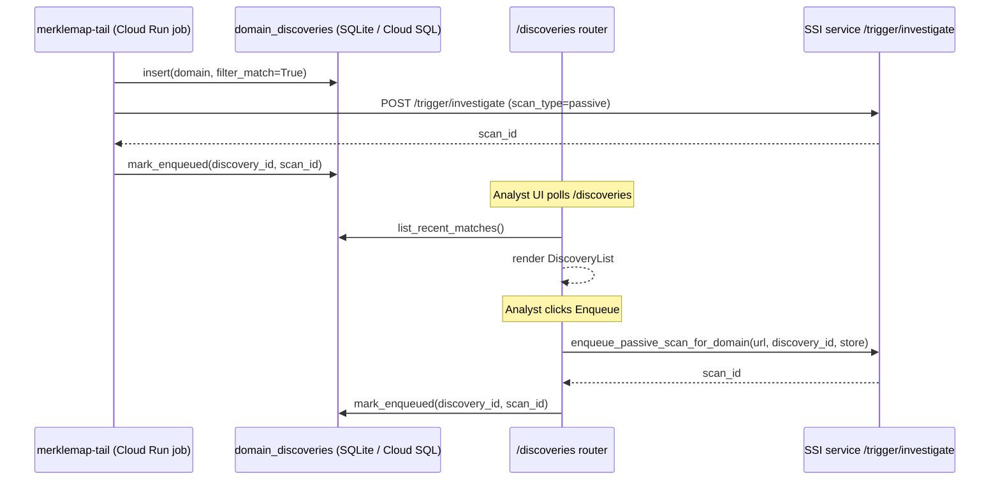

# PhishDestroy Integration — Architecture

> **Scope:** Sprint 1 (Phases A–E2 + Wrap-up). Sprint 2 surfaces (chats, damage scores,
> infra brands) are out of scope here.

## Overview

PhishDestroy integration ingests known scam actors from the
[DestroyScammers](../../phishdestroy/DestroyScammers/) dataset (Phase B), monitors
live certificate-transparency logs via the Merklemap SSE stream for new phishing domains
(Phase C), and automatically triggers a passive SSI scan when a brand regex matches.



## Data Model

Five tables landed in Phase A (migration `2026-04-24_phishdestroy_sprint1.py`).
All live in the shared SQLite / Cloud SQL instance alongside existing i4g tables.

| Table | Purpose | Notable columns |
|---|---|---|
| `threat_actors` | Canonical scam actor record | `real_name` (`sensitive=true`), `handle`, `actor_type` |
| `actor_identities` | Platform identities for an actor | `platform`, `identifier`, `actor_id` (FK) |
| `actor_identity_edges` | Relationships between identities | `source_id`, `target_id`, `edge_type` |
| `blocklist_hits` | DestroyScammers destroylist matches | `domain`, `actor_id` (FK), `matched_at` |
| `domain_discoveries` | Merklemap SSE stream events | `domain`, `filter_match`, `enqueued_scan_id`, `dismissed_at` |

`threat_actors.real_name` is marked `sensitive=true` in the schema and omitted from
all public API responses — see [`src/i4g/store/sql.py`](../../../src/i4g/store/sql.py).

## Stores & Factories

Each store follows the project-standard `build_*` factory pattern in
[`src/i4g/services/factories.py`](../../../src/i4g/services/factories.py).

| Store class | Factory | Purpose |
|---|---|---|
| `ThreatActorStore` | `build_threat_actor_store()` | CRUD for `threat_actors` |
| `ActorIdentityStore` | `build_actor_identity_store()` | CRUD for `actor_identities` |
| `ActorIdentityEdgeStore` | `build_actor_identity_edge_store()` | Graph edges between identities |
| `BlocklistHitStore` | `build_blocklist_hit_store()` | Persist destroylist match events |
| `DomainDiscoveryStore` | `build_domain_discovery_store()` | Merklemap SSE discovery staging |

## Settings

All PhishDestroy settings live under the `[phishdestroy.*]` section of
[`config/settings.default.toml`](../../../config/settings.default.toml).
Env-var overrides follow the `I4G_<SECTION>__<KEY>` pattern.

### `[phishdestroy.destroylist]`

| Key | Default | Env-var override | Notes |
|---|---|---|---|
| `enabled` | `false` | `I4G_PHISHDESTROY__DESTROYLIST__ENABLED` | Flip to ingest |
| `commit_sha` | `c40cbbf527...` | — | Pinned upstream SHA; see §Provenance Contract |
| `data_path` | `phishdestroy/DestroyScammers/data/data.json` | `I4G_PHISHDESTROY__DESTROYLIST__DATA_PATH` | Relative to project root |

### `[phishdestroy.merklemap_tail]`

| Key | Default | Env-var override | Notes |
|---|---|---|---|
| `enabled` | `false` | `I4G_PHISHDESTROY__MERKLEMAP_TAIL__ENABLED` | Flip to stream |
| `api_key` | `""` | `PHISHDESTROY__MERKLEMAP_TAIL__API_KEY` | Never commit; use Secret Manager |
| `brand_regexes` | (list, see toml) | — | Case-insensitive; extend in `settings.local.toml` |
| `batch_size` | `100` | `I4G_PHISHDESTROY__MERKLEMAP_TAIL__BATCH_SIZE` | Events per log flush |
| `flush_interval_seconds` | `5` | `I4G_PHISHDESTROY__MERKLEMAP_TAIL__FLUSH_INTERVAL_SECONDS` | Counter log cadence |

## Provider Gating

External provider calls (Merklemap API, Whoxy) are gated by per-provider
`enabled` flags in `[providers.*]`. Google OSINT runs natively in SSI using
browser session cookies (see `ssi/src/ssi/osint/google/`). The merklemap-tail worker applies its own
early-exit check (`cfg.enabled` + `cfg.api_key`) rather than going through
`ProviderGate` — appropriate for a long-running Cloud Run job whose lifecycle
is binary ("job exists or it doesn't").

Full gating policy: [`copilot/.github/shared/phishdestroy-provider-gating.instructions.md`](../../../../copilot/.github/shared/phishdestroy-provider-gating.instructions.md).
SSI provider gate implementation: [`ssi/src/ssi/providers/gate.py`](../../../../ssi/src/ssi/providers/gate.py).

## Provenance Contract

All upstream data sources are SHA-pinned at ingest time.
Full contract: [`copilot/.github/shared/phishdestroy-provenance.instructions.md`](../../../../copilot/.github/shared/phishdestroy-provenance.instructions.md).

Pinned upstream SHAs from §4 of that document:

- **DestroyScammers dataset:** `c40cbbf527dd9e5e232090346e1a8ceab32d1683` (2025-11-30)
- **Merklemap tail stream:** `550cb04aa633c000724c339ada085c59444d5b78` (Phase C commit)

The `source_provenance` JSONB column on `domain_discoveries` (and analogous columns on
`blocklist_hits`) carries these SHAs at the row level so every record is independently
traceable.

## Worker: merklemap-tail

**Entry point:** [`src/i4g/worker/jobs/merklemap_tail.py`](../../../src/i4g/worker/jobs/merklemap_tail.py)
— `main()` → `asyncio.run(_run(...))`.

**Lifecycle:**

1. Reads settings; exits early if `enabled=False` or `api_key` empty (exit code 2).
2. Compiles `brand_regexes` into `re.Pattern` objects.
3. Opens an SSE connection via `i4g.clients.merklemap.tail(api_key=...)`.
4. For each `DomainDiscovery` event: inserts a `domain_discoveries` row; on brand match,
   calls `enqueue_passive_scan_for_domain(url, discovery_id, store)`.
5. Handles `SIGTERM` via `asyncio.Event`; flushes counters on shutdown.

**Signal handling:** `SIGTERM` sets the shutdown event; the loop exits after the current
event finishes. Cloud Run sends `SIGTERM` 10 s before `SIGKILL`.

**Counters:** emitted at every `flush_interval_seconds` and on shutdown as:

```
merklemap-tail counters (flush): events=N matches=M scans_enqueued=K scan_failures=J
```

**Short-bound smoke run flags:** `--max-runtime-seconds` and `--max-events` (both optional).

## API: /discoveries

Router: [`src/i4g/api/phishdestroy_discoveries.py`](../../../src/i4g/api/phishdestroy_discoveries.py).
Mounted at `/discoveries` by the main FastAPI app. All routes require `require_token`.

| Endpoint | Method | Purpose |
|---|---|---|
| `/discoveries` | `GET` | Paginated list of filter-matched, non-dismissed discoveries |
| `/discoveries/{id}/enqueue` | `POST` | Trigger (or re-trigger) a passive SSI scan |
| `/discoveries/{id}/dismiss` | `POST` | Soft-dismiss without scanning |

Query params on `GET`: `limit` (1–200, default 50), `offset`, `since` (ISO datetime).

## Local Smoke

Before deploying to Cloud Run (Phase D2), rehearse with the local Docker harness:

```bash
export PHISHDESTROY__MERKLEMAP_TAIL__API_KEY=<your-key>
python scripts/smoke_merklemap_tail_local.py
# Copy the printed docker run command and execute it.
```

Script: [`scripts/smoke_merklemap_tail_local.py`](../../../scripts/smoke_merklemap_tail_local.py).
Prerequisites: `scripts/build_image.sh ingest-job dev` must have produced `ingest-job:dev`.

## Open Items

- **Phase D2** (GCP billing gate): `terraform apply` in `i4g-dev`, populate
  `merklemap-api-key` secret via Secret Manager, run the 30-min Cloud Run smoke.
- **Sprint 2 scope** (per `planning/tasks/phishdestroy_integration_tasks.md` §5.2):
  chat enrichment pipeline, damage-score model integration, infra brand expansion.
- `_trigger_investigation` in `auto_investigate.py` and `enqueue_passive_scan_for_domain`
  are intentionally separate helpers (different scan types, audit hooks). Unification
  is deferred to Sprint 4 polish.
