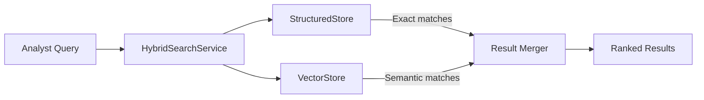
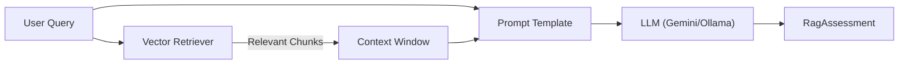

# RAG & Hybrid Search Architecture

> **Status**: Active (v1.2)
> **Last Updated**: April 2026

This document describes the retrieval and search architecture within the I4G platform. The system provides two complementary search paths: **Hybrid Search** (primary, used by the analyst console) and a **RAG Pipeline** (used for CLI-driven scam assessment).

## Hybrid Search (Primary — Discovery Page)

The analyst console's Discovery page uses `HybridSearchService`, which combines structured database queries with semantic similarity search. This is the primary search path for analysts.



### Components

1. **HybridRetriever** (`src/i4g/store/retriever.py`):
   - Combines structured + vector + entity stores
   - Merges results using `max_weighted` strategy with tie-breaker
   - Falls back to structured-only search if vector store is unavailable

2. **HybridSearchService** (`src/i4g/services/hybrid_search.py`):
   - Coordinates the retriever and merges results
   - Used by `/discovery` API endpoint
   - Falls back to local retriever if GCP Discovery backend fails

3. **Vector Store**:
   - **Cloud**: Vertex AI Search (`retrieval-poc` data store)
   - **Local**: Chroma (`data/chroma_store`)
   - Content: embeddings generated from `source_documents` chunks

## RAG Pipeline (CLI — Scam Assessment)

The RAG pipeline (`src/i4g/rag/pipeline.py`) is a LangChain LCEL chain used for local scam detection testing via the `i4g search query` CLI command. It is not used by the analyst console API.



### Design

- **Provider-agnostic**: uses `build_langchain_llm()` respecting `settings.llm.provider` (Vertex AI, Ollama, mock)
- **Structured output**: validates LLM response against `RagAssessment` Pydantic schema with retry on parse failure
- **Few-shot examples**: golden examples from `src/i4g/rag/golden_examples.json` injected into prompts
- **Citation-aware**: numbered document chunks enable the LLM to reference specific evidence
- **External templates**: prompt templates loaded from disk (`{{ placeholder }}` syntax)

### Usage

```python
from i4g.rag.pipeline import build_scam_detection_chain
from i4g.store.vector import get_vector_store

vector_store = get_vector_store()
chain = build_scam_detection_chain(vector_store)

result = chain.invoke({"question": "Is this investment platform legit?"})
print(result)
```

## Future Improvements

- **API integration**: Expose RAG assessment as an API endpoint for analyst-assisted analysis
- **Active retrieval**: Let the LLM request additional context when initial retrieval is insufficient
