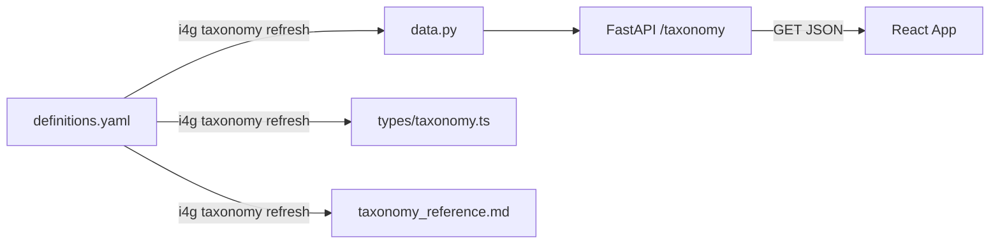

# Taxonomy Management Guide

The **Fraud Taxonomy** is the central classification system used to tag cases, standardized reporting, and drive analytics.

Unlike traditional static enums, i4g uses a **Dynamic Taxonomy** system where definitions are managed in a single YAML file and served dynamically via the API. This ensures that the Python backend, React frontend, and documentation always stay in sync without requiring full rebuilds for content changes.

## Single Source of Truth

The canonical definitions are stored in:
`core/src/i4g/taxonomy/definitions.yaml`

This file defines:
- **Intents** (e.g., `INTENT.ROMANCE`)
- **Channels** (e.g., `CHANNEL.SMS`)
- **Social Engineering Techniques** (e.g., `SE.URGENCY`)
- **Requested Actions** (e.g., `ACTION.CRYPTO`)
- **Claimed Personas** (e.g., `PERSONA.BANK`)

## Updating the Taxonomy

To add or modify a label:

1.  **Edit the definitions:**
    Open `core/src/i4g/taxonomy/definitions.yaml` and add your new item.
    ```yaml
    intents:
      - code: "INTENT.NEW_SCAM"
        label: "New Scam Type"
        description: "Description of the scam..."
    ```

2.  **Run the refresh command:**
    ```bash
    i4g taxonomy refresh
    ```
    This command:
    *   Generates `core/src/i4g/taxonomy/data.py` (Backend Data Source).
    *   Generates `ui/packages/types/src/taxonomy.ts` (Frontend Interfaces).
    *   Generates `docs/book/api/taxonomy_reference.md` (Documentation).

3.  **Restart the API:**
    If the API is running locally (`uvicorn`), restart it to load the new `data.py`. The frontend will automatically fetch the new metadata upon page reload.

## Architecture



### Why this approach?
*   **Decoupling:** The UI doesn't need to be rebuilt just to fix a typo in a description.
*   **Consistency:** The API serves the exact same data structure that the LLM uses for classification.
*   **Extensibility:** New categories can be added purely via configuration.
