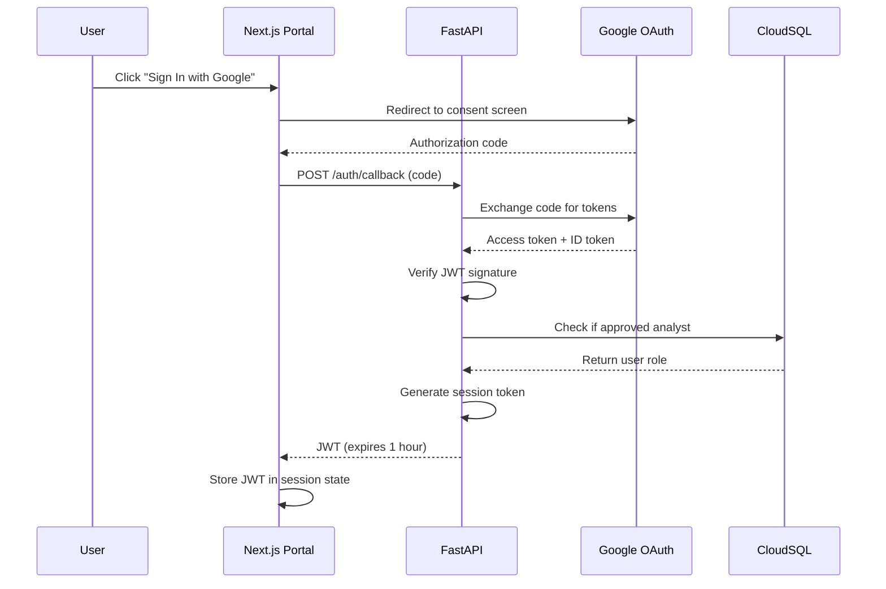

# Core Service — Master Technical Design Document

> **This is the master TDD for `core-svc`.** It scopes the system and links to detailed design documents.
> It is not a monolithic spec — deep implementation detail lives in the linked subsystem docs.
> Read this document first; follow links for the detail you need.
>
> **Version:** 3.0 • **Last Updated:** March 2026 • **Last Verified:** March 2026

For high-level architecture diagrams and deployment topology, start with [architecture.md](../design/architecture.md).
For platform-level context (all services, integration contracts, ADRs), see [system_narrative.md](../../../planning/architecture/system_narrative.md).

**Audience:** Software engineers, DevOps/SRE, security reviewers.

### Quick Navigation

- [System Scope](#1-system-scope)
- [Subsystem Index](#2-subsystem-index)
- [Key Architectural Decisions](#3-key-architectural-decisions)
- [Configuration and Environment](#4-configuration-and-environment)
- [Ingestion Flow](#5-ingestion-flow-canonical)
- [APIs and Contracts](#6-apis-and-contracts-current-surface)
- [Data Model and Schemas](#7-data-model-and-schemas)
- [Reports and Dossiers](#8-reports-and-dossiers)
- [Deployment Profiles](#9-deployment-profiles)
- [Security and Compliance](#10-security-and-compliance)
- [Testing and Validation](#11-testing-and-validation)

---

## 1) System Scope

`core-svc` is the central FastAPI backend for the I4G platform. It owns:

- The full analyst API surface (22 routers: reviews, cases, intakes, reports, analytics, intelligence, campaigns, taxonomy, feeds, etc.)
- The ingestion pipeline: normalization → SQL dual-write → vector indexing → PII encryption
- Report and dossier generation
- TIFAP (Threat Intelligence & Fraud Analytics Platform) — graph service, campaign detection, partner feeds — **internal to core-svc, not a separate service**
- The SSI integration orchestration layer (core is the caller; SSI is a separate Cloud Run service)

**Explicit boundaries** — `core-svc` does NOT:

- Run browser automation or headless Chromium (that is `ssi-svc`)
- Own the analyst console frontend (that is `ui/apps/web/`, a Next.js app on a separate Cloud Run service)
- Run on the same process as SSI; cross-service calls are HTTP with OIDC auth

---

## 2) Subsystem Index

| Subsystem                                          | Brief Description                                                  | Primary Doc                                                                                                                       | Last Verified |
| -------------------------------------------------- | ------------------------------------------------------------------ | --------------------------------------------------------------------------------------------------------------------------------- | ------------- |
| Ingestion pipeline (ingest-job, intake-job)        | Normalize → encrypt PII → dual-write SQL + vector                  | [jobs.md](../design/jobs.md)                                                                                                      | ?             |
| Review/search API (HybridRetriever, ReviewStore)   | Hybrid retrieval, saved searches, analyst queue                    | [rag.md](../design/rag.md)                                                                                                        | ?             |
| Analyst console API surface (22 routers)           | Full REST surface for the Next.js console                          | [api_reference.md](../api_reference.md)                                                                                           | ?             |
| Report generation (report-job, template system)    | Dossier assembly, LEA handoff, signature manifest                  | [jobs.md](../design/jobs.md)                                                                                                      | ?             |
| Fraud taxonomy system (LLM tagging, versioning)    | Classification, tag hierarchy, confidence versioning               | [fraud_taxonomy_tdd.md](../design/fraud_taxonomy_tdd.md)                                                                          | ?             |
| Threat Intelligence / TIFAP (campaign detection)   | Graph service, watchlist, partner indicator feeds                  | [threat_intelligence_analytics_tdd.md](../design/threat_intelligence_analytics_tdd.md)                                            | ?             |
| Campaign governance bridge                         | Links campaigns to fraud taxonomy classification                   | [campaign_governance_bridge.md](../design/campaign_governance_bridge.md)                                                          | ?             |
| PII vault (Fernet encryption, audit-logged access) | Victim contact encryption, key rotation, audit log                 | [pii_vault.md](../design/pii_vault.md)                                                                                            | March 2026    |
| SSI integration (enrichment contracts)             | Core→SSI enrich requests, SSI→Core callbacks                       | [ssi/docs/tdd.md](../../../ssi/docs/tdd.md) + [integration_contracts.md](../../../planning/architecture/integration_contracts.md) | March 2026    |
| Background job system (4 Cloud Run jobs)           | ingest-bootstrap, process-intakes, generate-reports, dossier-queue | [jobs.md](../design/jobs.md)                                                                                                      | ?             |
| Data stores (SQL, vector, blob)                    | Cloud SQL / SQLite, Chroma / Vertex AI, GCS                        | [storage.md](../design/storage.md) + [data_model.md](../design/data_model.md)                                                     | ?             |
| IAM and authentication                             | IAP, OIDC, service accounts, role matrix                           | [iam.md](../design/iam.md)                                                                                                        | ?             |
| Retrieval (RAG, hybrid search)                     | LangChain LCEL, vector + SQL merge, structured filters             | [rag.md](../design/rag.md)                                                                                                        | ?             |

> Items marked `?` for Last Verified should be confirmed during the next quarterly doc review (see `copilot/.github/shared/doc-governance.instructions.md`).

---

## 3) Key Architectural Decisions

| Decision                | Choice Made                                           | Key Reason                                                                                                          | ADR                                                                             |
| ----------------------- | ----------------------------------------------------- | ------------------------------------------------------------------------------------------------------------------- | ------------------------------------------------------------------------------- |
| Cloud provider          | GCP (Cloud Run, Cloud SQL, Vertex AI, Secret Manager) | Nonprofit credits, managed serverless                                                                               | [ADR-001](../../../planning/architecture/adr/adr-001-azure-to-gcp-migration.md) |
| API framework           | FastAPI + Pydantic v2                                 | Async-first, automatic schema validation, `alias_generator = to_camel` eliminates manual translation                | [ADR-002](../../../planning/architecture/adr/adr-002-fastapi-pydantic-v2.md)    |
| SSI as separate service | ssi-svc on its own Cloud Run instance                 | Browser automation isolation; Chromium can't share a container with the API under Cloud Run constraints             | [ADR-003](../../../planning/architecture/adr/adr-003-ssi-separate-service.md)   |
| PII encryption          | Fernet (symmetric, audited)                           | Key-per-tenant not yet needed; Fernet is well-audited, fast for field-level encryption, and supports key rotation   | [ADR-004](../../../planning/architecture/adr/adr-004-pii-vault-fernet.md)       |
| Vector store            | Chroma (local) / Vertex AI Search (cloud)             | Chroma for frictionless local dev; Vertex AI Search in production for managed scaling                               | [ADR-005](../../../planning/architecture/adr/adr-005-chroma-vs-pgvector.md)     |
| Task status             | In-memory `TASK_STATUS` dict                          | Simplest implementation for single-instance dev; known limitation for multi-instance prod (Redis migration planned) | —                                                                               |
| Settings pattern        | `I4G_*` env vars with `__` nesting                    | Pydantic BaseSettings with TOML defaults gives deterministic override chain without custom parsing                  | [config docs](../config/)                                                       |

---

## 4) Configuration and Environment

## 4) Configuration and Environment

- Load settings via `i4g.settings.get_settings()`; overrides: `config/settings.*.toml` → `.env.local` → `I4G_*` env vars (double underscores for nesting).
- Key toggles (ingestion):
  - `ingestion.enable_sql` (dual-write tables)
  - `ingestion.enable_vector_store`
  - `ingestion.enable_vertex`
  - `ingestion.default_dataset`
- Paths: `storage.sqlite_path`, `vector.chroma_dir`, `ingestion.dataset_path`, `data/` assets seeded via `i4g bootstrap local reset --report-dir data/reports/local_bootstrap`.
- Secrets: prefer Secret Manager in managed envs; local `.env.local` for the Fernet key (`I4G_CRYPTO__PII_KEY`).
- For adding a new setting: (a) add under the appropriate section in `config/settings.default.toml`, (b) add coverage under `tests/unit/settings/`, (c) refresh `docs/config/` env-var table + YAML manifest via `scripts/export_settings_manifest.py`.

### Data Stores (quick reference)

See [storage.md](../design/storage.md) and the Subsystem Index for full detail.

---

## 5) Ingestion Flow (canonical)

1. **Input normalization**: `prepare_ingest_payload()` merges text, entities, structured fields, network entities, metadata, dataset.
2. **Intake encryption**: `IntakeStore.create()` encrypts victim contact fields (reporter_name, contact_email, contact_phone, contact_handle) with Fernet before the database write.
3. **Structured write**: `StructuredStore.upsert_record()` persists the `ScamRecord` for console reads.
4. **Case bundle build**: `build_case_bundle()` assembles `CasePayload`, `SourceDocumentPayload`, `EntityPayload` from classification result and metadata.
5. **SQL dual-write**: `SqlWriter.persist_case_bundle()` writes cases/entities/documents; controlled by `enable_sql`.
6. **Vector write**: `vector_store.add_records()` writes embeddings when vector enabled; Vertex writer optional.
7. **Optional fan-out**: Vertex fan-out gated by settings and env (and builder availability).
8. **Retry**: ingestion retry queue (SQL table) for downstream fan-out errors.

## 7) APIs and Contracts (current surface)

- **Search/Reviews**
  - `POST /reviews/search` and `GET /reviews/search/schema`; payload matches `HybridSearchRequest` (text + vector/structured filters).
  - `GET /reviews/{id}` returns case/review details with entity annotations; aligns with SQL + structured store schema.
  - Saved searches: stored per owner/shared; schema driven by `search.saved_search` settings; admin CLI `i4g-admin export/import`.
- **Tasks/Status**
  - `GET /tasks/{task_id}` for job state (ingestion/report jobs); used by UI for progress.
- **Intake API**
  - `POST /intakes/` creates a new intake record (contact fields encrypted at rest).
  - `GET /intakes/{id}/contact` returns decrypted contact fields with audit logging.
- **Reports/Dossiers**
  - Report generation entrypoints map to worker tasks; dossiers produced by queue jobs and surfaced in console.
- **Ingestion jobs**
  - CLI/Cloud Run jobs (`i4g jobs ingest`, `i4g jobs intake`) consume normalized ingestion payloads (`prepare_ingest_payload` contract).

## 8) Data Model and Schemas

- **Structured store record** (`ScamRecord`): `case_id`, `text`, `entities{type:[value]}`, `classification`, `confidence`, `metadata`.
- **SQL dual-write tables** (see `src/i4g/store/sql.py`):
  - `cases`: dataset, classification, confidence, raw_text_sha256, status, metadata.
  - `entities`: entity_type, canonical_value, raw_value, confidence (unique per case/type/value).
  - `source_documents`: text chunks, mime, source_url, chunk_index/count.
  - `indicators`: structured signals (email/phone/ip/crypto/wallet/etc.).
  - `ingestion_runs`: run metadata and counts; `ingestion_retry_queue`: fan-out retries.
- **Vector store payload**: chunked text with case_id/document_id; embeddings stored in Chroma by default.
- **Intake encryption**: `intake_records` table stores Fernet-encrypted contact fields; decrypted on authorized read.
- **Saved search schema**: JSON schema at `/reviews/search/schema`; snapshot at `docs/examples/reviews_search_schema.json`.

## 9) Reports and Dossiers

- **Generation**: `generate_report_for_case` and dossier queue workers produce manifests and signed bundles.
- **Signatures**: manifests hashed and signed; verification helper in `src/i4g/reports/dossier_signatures.py`.
- **Handoff**: runbooks in `docs/runbooks/console/reports.md` and `docs/runbooks/dossiers_subpoena_handoff.md`.

## 10) Deployment Profiles

- **Managed (Cloud Run/GCP)**: Cloud SQL/Cloud Storage, Secret Manager, Vertex optional; Workload Identity; IAP for portals.
- **Local**: SQLite + Chroma, mock identity, `.env.local` secrets, scheduled jobs off; run via `uvicorn i4g.api.app:app --reload` and cookbooks in `docs/cookbooks/`.
- Settings remain identical across profiles; swapping is env + config only.

## 11) Security & Privacy

- Victim contact fields encrypted at intake via Fernet; investigation entities stored in cleartext.
- Access control: Identity Platform/IAP (managed), mock tokens (local). Audit logging via store log actions.
- Secrets management: Secret Manager in managed envs; avoid embedding secrets in code/docs.
- Data residency: artifacts under `data/` locally; buckets per env.

## 12) Testing & Quality

- Unit/contract tests in `tests/unit/`; settings/env overrides covered in `tests/unit/settings/`.
- Smokes and recipes: `docs/cookbooks/smoke_test.md`, `docs/cookbooks/bootstrap_environments.md`.
- Runbooks: `docs/runbooks/` for operational checks; Playwright smokes in `ui/` for console.
- Before releases: follow `docs/release/README.md` checklist; regenerate settings manifests when toggles change (`scripts/export_settings_manifest.py`).

## 13) Open Follow-Ups

- Add pgvector/Vertex AI vector backends to parity with Chroma in factories.
- Refresh saved-search schema snapshot and ensure UI fixtures stay aligned.
- Expand TDD API section with up-to-date request/response samples for search/tasks/intake once stabilized.
  "assigned_to": "analyst_uid_456",
  "updated_at": "2025-10-30T15:00:00Z"
  }

````

---

### Endpoint: `POST /api/cases/{case_id}/notes`

**Description**: Add analyst note to case

**Authentication**: Required

**Request Body**:
```json
{
  "text": "Verified wire transfer receipt. Recommend contacting bank."
}
````

**Response** (201 Created):

```json
{
  "note_id": "uuid-v4",
  "author": "analyst_uid_123",
  "author_name": "Jane Doe",
  "text": "Verified wire transfer receipt...",
  "timestamp": "2025-10-30T15:30:00Z"
}
```

---

### Endpoint: `POST /api/cases/{case_id}/approve`

**Description**: Approve case and generate LEO report

**Authentication**: Required (analyst or admin)

**Request Body**:

```json
{
  "user_consent": true
}
```

**Response** (200 OK):

```json
{
  "case_id": "uuid-v4",
  "status": "closed",
  "report_url": "https://storage.googleapis.com/i4g-reports/2025/10/30/case_uuid.pdf",
  "report_generated_at": "2025-10-30T16:00:00Z"
}
```

**Implementation Steps**:

1. Verify analyst has access to case
2. Fetch decrypted contact data from `/intakes/{id}/contact`
3. Decrypt PII
4. Generate PDF report with real PII
5. Upload PDF to Cloud Storage
6. Email user with secure download link
7. Update case status to `closed`

---

### Endpoint: `GET /api/cases/{case_id}/export`

**Description**: GDPR-compliant data export

**Authentication**: Optional (user can use email-based token)

**Response** (200 OK):

```json
{
  "case_id": "uuid-v4",
  "exported_at": "2025-10-30T16:30:00Z",
  "data": {
    "title": "Romance scam - lost $10K",
    "description": "Full description with real PII (not tokens)",
    "evidence_files": ["url1", "url2"],
    "notes": [...],
    "created_at": "2025-10-30T12:00:00Z"
  }
}
```

---

### Endpoint: `DELETE /api/cases/{case_id}`

**Description**: GDPR-compliant hard delete

**Authentication**: Required (user or admin)

**Response** (204 No Content)

**Implementation Steps**:

1. Delete from `cases` table
2. Delete intake records (encrypted contact data removed with the row)
3. Delete evidence files from Cloud Storage
4. Delete vector embeddings from ChromaDB
5. Log deletion in audit trail

---

## PII Tokenization Implementation

### Regex Patterns

```python
PII_PATTERNS = {
    "ssn": r"\b\d{3}-\d{2}-\d{4}\b",
    "email": r"\b[A-Za-z0-9._%+-]+@[A-Za-z0-9.-]+\.[A-Z|a-z]{2,}\b",
    "phone": r"\b(\+\d{1,2}\s?)?\(?\d{3}\)?[\s.-]?\d{3}[\s.-]?\d{4}\b",
    "credit_card": r"\b\d{4}[\s-]?\d{4}[\s-]?\d{4}[\s-]?\d{4}\b",
    "address": r"\b\d+\s+[\w\s]+(?:Street|St|Avenue|Ave|Road|Rd|Boulevard|Blvd)\b",
    "dob": r"\b\d{1,2}/\d{1,2}/\d{4}\b",
}
```

### LLM-Assisted Extraction

For contextual PII (e.g., "my social is 123-45-6789"), use LLM:

**Prompt**:

```python
prompt = f"""
Extract all personally identifiable information (PII) from the following text.
Return only JSON with keys: ssn, email, phone, credit_card, address, dob.
If a type is not present, omit the key.

Text: {user_input}

JSON:
"""

response = ollama.chat(model="llama3.1", messages=[{"role": "user", "content": prompt}])
pii = json.loads(response['message']['content'])
```

**Example**:

```json
{
  "ssn": "123-45-6789",
  "email": "user@example.com",
  "phone": "(555) 123-4567"
}
```

### Encryption

```python
from cryptography.fernet import Fernet
import os

# Load encryption key from Secret Manager
encryption_key = os.getenv("TOKEN_ENCRYPTION_KEY")
cipher = Fernet(encryption_key)

def encrypt_pii(plaintext: str) -> bytes:
    return cipher.encrypt(plaintext.encode())

def decrypt_pii(ciphertext: bytes) -> str:
    return cipher.decrypt(ciphertext).decode()
```

### Token Format

```
<PII:{TYPE}:{HASH}>

Examples:
- <PII:SSN:7a8f2e>
- <PII:EMAIL:9b1c4d>
- <PII:PHONE:3e5f8a>
```

**Hash Generation**:

```python
import hashlib

def generate_token(pii_value: str, pii_type: str) -> str:
    hash_obj = hashlib.sha256(pii_value.encode())
    hash_hex = hash_obj.hexdigest()[:6]  # First 6 chars
    return f"<PII:{pii_type.upper()}:{hash_hex}>"
```

---

## OAuth 2.0 Implementation

### Google Sign-In Flow



### FastAPI Implementation

```python
from fastapi import FastAPI, Depends, HTTPException
from fastapi.security import OAuth2PasswordBearer
from google.oauth2 import id_token
from google.auth.transport import requests

app = FastAPI()
oauth2_scheme = OAuth2PasswordBearer(tokenUrl="token")

async def get_current_user(token: str = Depends(oauth2_scheme)):
    try:
        # Verify JWT
        idinfo = id_token.verify_oauth2_token(
            token,
            requests.Request(),
            os.getenv("GOOGLE_CLIENT_ID")
        )

        # Check if user is approved analyst
        user_doc = db.collection("analysts").document(idinfo['sub']).get()
        if not user_doc.exists or not user_doc.to_dict().get('approved'):
            raise HTTPException(status_code=403, detail="Not an approved analyst")

        return {
            "uid": idinfo['sub'],
            "email": idinfo['email'],
            "role": user_doc.to_dict().get('role', 'analyst')
        }
    except ValueError:
        raise HTTPException(status_code=401, detail="Invalid token")

@app.get("/api/cases")
async def list_cases(user: dict = Depends(get_current_user)):
    # user is guaranteed to be authenticated and approved
    cases = db.collection("cases").where("assigned_to", "==", user['uid']).stream()
    return {"cases": [case.to_dict() for case in cases]}
```

---

## Database Schema

### Table: `cases`

```typescript
interface Case {
  case_id: string;
  created_at: Timestamp;
  updated_at: Timestamp;

  // User info
  user_email: string;
  title: string;
  description: string; // Contains PII tokens: <PII:SSN:7a8f2e>

  // Classification
  classification: {
    type: "Romance Scam" | "Crypto Scam" | "Phishing" | "Other";
    confidence: number; // 0.0 - 1.0
    llm_model: string; // "llama3.1"
  };

  // Status
  status:
    | "new"
    | "in_review"
    | "awaiting_input"
    | "accepted"
    | "rejected"
    | "closed";
  assigned_to: string | null; // analyst UID

  // Evidence
  evidence_files: Array<{
    filename: string;
    url: string; // gs:// URL
    mime_type: string;
    size_bytes: number;
  }>;

  // Analyst notes
  notes: Array<{
    author: string; // analyst UID
    author_name: string;
    text: string;
    timestamp: Timestamp;
  }>;

  // Lifecycle
  resolved_at: Timestamp | null;
  archived: boolean;
}
```

---

### Table: `intake_records` (encrypted fields)

```typescript
interface IntakeRecord {
  intake_id: string;
  reporter_name: Uint8Array; // Fernet-encrypted
  contact_email: Uint8Array; // Fernet-encrypted
  contact_phone: Uint8Array; // Fernet-encrypted
  contact_handle: Uint8Array; // Fernet-encrypted
  summary: string;
  details: string;
  created_at: Timestamp;
}
```

---

### Table: `analysts`

```typescript
interface Analyst {
  uid: string; // Google OAuth UID
  email: string;
  full_name: string;
  role: "analyst" | "admin";
  approved: boolean; // Must be true to access cases
  ferpa_certified: boolean;
  last_login: Timestamp;
  created_at: Timestamp;
}
```

---

## Security Design

### STRIDE Threat Model

| Threat                     | Mitigation                                                 |
| -------------------------- | ---------------------------------------------------------- |
| **Spoofing**               | OAuth 2.0 (Google trusted provider), JWT signatures        |
| **Tampering**              | Database access controls, TLS 1.3, read-only API for users |
| **Repudiation**            | Audit logs (all contact decryption access logged)          |
| **Information Disclosure** | Intake encryption, encryption at rest, HTTPS               |
| **Denial of Service**      | Cloud Armor (DDoS protection), rate limiting               |
| **Elevation of Privilege** | Database access controls, role-based access control        |

---

### Encryption

**At Rest**:

- Cloud SQL: Encryption at rest (AES-256)
- Cloud Storage: Customer-managed encryption keys (CMEK)
- PII Vault: Fernet encryption for victim contact fields

**In Transit**:

- All API calls: TLS 1.3
- Cloud Run: HTTPS only (HTTP redirects to HTTPS)

---

## Monitoring & Observability

### Structured Logging

```python
import logging
import json
from uuid import uuid4

logger = logging.getLogger(__name__)

def log_event(action: str, user_id: str, metadata: dict):
    log_entry = {
        "timestamp": datetime.utcnow().isoformat(),
        "severity": "INFO",
        "correlation_id": str(uuid4()),
        "user_id": user_id,
        "action": action,
        "metadata": metadata
    }
    logger.info(json.dumps(log_entry))

# Usage
log_event("case_approved", user['uid'], {"case_id": case_id, "classification": "Romance Scam"})
```

**Log Output**:

```json
{
  "timestamp": "2025-10-30T12:00:00Z",
  "severity": "INFO",
  "correlation_id": "uuid-v4",
  "user_id": "analyst_uid_123",
  "action": "case_approved",
  "metadata": {
    "case_id": "uuid-v4",
    "classification": "Romance Scam"
  }
}
```

---

### Custom Metrics

```python
from google.cloud import monitoring_v3

client = monitoring_v3.MetricServiceClient()
project_name = f"projects/{os.getenv('GCP_PROJECT_ID')}"

def record_contact_decrypt_access(case_id: str):
    series = monitoring_v3.TimeSeries()
    series.metric.type = "custom.googleapis.com/i4g/contact_decrypt_access"
    series.resource.type = "global"

    point = monitoring_v3.Point()
    point.value.int64_value = 1
    point.interval.end_time = datetime.utcnow()

    series.points = [point]
    client.create_time_series(name=project_name, time_series=[series])
```

---

### Alerting Policies

**Error Rate Alert**:

```yaml
displayName: "High Error Rate"
conditions:
  - displayName: "5xx errors > 5% for 5 minutes"
    conditionThreshold:
      filter: 'resource.type="cloud_run_revision" AND metric.type="run.googleapis.com/request_count" AND metric.labels.response_code_class="5xx"'
      comparison: COMPARISON_GT
      thresholdValue: 0.05
      duration: 300s
notificationChannels:
  - "projects/i4g-prod/notificationChannels/email-jerry"
```

---

## CI/CD Pipeline

### GitHub Actions Workflow

```yaml
name: CI/CD
on:
  push:
    branches: [main]
  pull_request:
    branches: [main]

jobs:
  test:
    runs-on: ubuntu-latest
    steps:
      - uses: actions/checkout@v3

      - uses: actions/setup-python@v4
        with:
          python-version: "3.11"

      - name: Install dependencies
        run: |
          pip install -e ".[dev]"

      - name: Run linters
        run: |
          black --check src/ tests/
          isort --check src/ tests/
          mypy src/

      - name: Run tests
        run: |
          pytest tests/ --cov=src/i4g --cov-report=xml

      - name: Upload coverage
        uses: codecov/codecov-action@v3
        with:
          files: ./coverage.xml

  deploy:
    needs: test
    if: github.ref == 'refs/heads/main'
    runs-on: ubuntu-latest
    steps:
      - uses: actions/checkout@v3

      - uses: google-github-actions/setup-gcloud@v1
        with:
          service_account_key: ${{ secrets.GCP_SA_KEY }}
          project_id: i4g-prod

      - name: Build Docker image
        run: |
          docker build -t gcr.io/i4g-prod/api:${{ github.sha }} .
          docker tag gcr.io/i4g-prod/api:${{ github.sha }} gcr.io/i4g-prod/api:latest

      - name: Push to GCR
        run: |
          gcloud auth configure-docker
          docker push gcr.io/i4g-prod/api:${{ github.sha }}
          docker push gcr.io/i4g-prod/api:latest

      - name: Deploy to Cloud Run
        run: |
          gcloud run deploy i4g-api \
            --image gcr.io/i4g-prod/api:${{ github.sha }} \
            --region us-central1 \
            --platform managed \
            --allow-unauthenticated \
            --max-instances 10 \
            --memory 1Gi \
            --set-env-vars "ENVIRONMENT=production"
```

---

## Deployment Procedures

### Initial Setup

```bash
# 1. Create GCP project
gcloud projects create i4g-prod --name="i4g Production"

# 2. Enable APIs
gcloud services enable \
  run.googleapis.com \
  sqladmin.googleapis.com \
  storage.googleapis.com \
  secretmanager.googleapis.com \
  logging.googleapis.com \
  monitoring.googleapis.com

# 3. Create Cloud Storage bucket
gsutil mb -l us-central1 gs://i4g-evidence
gsutil mb -l us-central1 gs://i4g-reports

# 4. Create encryption key in Secret Manager
echo -n "$(python -c 'from cryptography.fernet import Fernet; print(Fernet.generate_key().decode())')" | \
  gcloud secrets create TOKEN_ENCRYPTION_KEY --data-file=-

# 5. Create service account
gcloud iam service-accounts create i4g-backend \
  --display-name="i4g Backend Service Account"

# 6. Grant Cloud SQL permissions
gcloud projects add-iam-policy-binding i4g-prod \
  --member="serviceAccount:i4g-backend@i4g-prod.iam.gserviceaccount.com" \
  --role="roles/cloudsql.client"
```

---

### Deploy to Cloud Run

```bash
# 1. Build Docker image
docker build -t gcr.io/i4g-prod/api:v1.0.0 .

# 2. Push to Google Container Registry
docker push gcr.io/i4g-prod/api:v1.0.0

# 3. Deploy to Cloud Run
gcloud run deploy i4g-api \
  --image gcr.io/i4g-prod/api:v1.0.0 \
  --region us-central1 \
  --platform managed \
  --allow-unauthenticated \
  --service-account i4g-backend@i4g-prod.iam.gserviceaccount.com \
  --max-instances 10 \
  --memory 1Gi \
  --timeout 300 \
  --set-env-vars "ENVIRONMENT=production" \
  --set-secrets "TOKEN_ENCRYPTION_KEY=TOKEN_ENCRYPTION_KEY:latest"

# 4. Get deployed URL
gcloud run services describe i4g-api --region us-central1 --format 'value(status.url)'
```

---

## Testing Strategy

### Unit Tests (80% coverage target)

```python
# tests/unit/test_intake_encryption.py
import pytest
from i4g.store.intake_store import IntakeStore

def test_contact_fields_encrypted_on_write():
    store = IntakeStore(engine=test_engine, fernet_key=test_key)
    record = store.create(reporter_name="Jane Doe", contact_email="jane@example.com")
    # Raw DB row should contain encrypted bytes, not cleartext
    raw = fetch_raw_row(record.intake_id)
    assert raw["reporter_name"] != "Jane Doe"
    assert raw["contact_email"] != "jane@example.com"

def test_contact_fields_decrypted_on_read():
    store = IntakeStore(engine=test_engine, fernet_key=test_key)
    record = store.create(reporter_name="Jane Doe", contact_email="jane@example.com")
    contact = store.get_contact(record.intake_id)
    assert contact["reporter_name"] == "Jane Doe"
    assert contact["contact_email"] == "jane@example.com"
```

---

### Integration Tests

```python
# tests/integration/test_case_workflow.py
import pytest
from fastapi.testclient import TestClient
from i4g.api.app import app

client = TestClient(app)

def test_case_submission_to_approval():
    # 1. Submit case
    response = client.post("/api/cases", json={
        "title": "Test scam",
        "description": "My SSN is 123-45-6789",
        "user_email": "test@example.com"
    })
    assert response.status_code == 201
    case_id = response.json()["case_id"]

    # 2. Analyst retrieves case (PII should be masked)
    analyst_token = get_test_jwt(role="analyst")
    response = client.get(
        f"/api/cases/{case_id}",
        headers={"Authorization": f"Bearer {analyst_token}"}
    )
    assert response.status_code == 200
    assert "███████" in response.json()["description"]
    assert "123-45-6789" not in response.json()["description"]

    # 3. Analyst approves case
    response = client.post(
        f"/api/cases/{case_id}/approve",
        headers={"Authorization": f"Bearer {analyst_token}"},
        json={"user_consent": True}
    )
    assert response.status_code == 200
    assert "report_url" in response.json()
```

---

## Performance Benchmarks

### Load Testing (Locust)

```python
# locustfile.py
from locust import HttpUser, task, between

class I4GUser(HttpUser):
    wait_time = between(1, 3)

    @task(3)
    def list_cases(self):
        self.client.get("/api/cases", headers={"Authorization": f"Bearer {self.token}"})

    @task(1)
    def view_case(self):
        self.client.get(f"/api/cases/{self.case_id}", headers={"Authorization": f"Bearer {self.token}"})

    def on_start(self):
        # Authenticate
        response = self.client.post("/auth/login", json={...})
        self.token = response.json()["access_token"]
        self.case_id = "test-case-id"
```

**Target Performance**:

- 20 concurrent users
- p95 latency < 2 seconds
- Error rate < 1%

---

## Disaster Recovery

### Backup Strategy

```bash
# Daily Cloud SQL backup (Cloud Scheduler cron job)
gcloud sql backups create --instance=i4g-prod \
  --description="daily-$(date +%Y%m%d)"

# Retention: 7 days
gsutil lifecycle set lifecycle.json gs://i4g-backups
```

**lifecycle.json**:

```json
{
  "lifecycle": {
    "rule": [
      {
        "action": { "type": "Delete" },
        "condition": { "age": 7 }
      }
    ]
  }
}
```

---

### Recovery Procedures

**Scenario 1: Accidental case deletion**

```bash
# 1. Find latest backup
gsutil ls gs://i4g-backups/

# 2. Restore from backup
gcloud sql backups restore BACKUP_ID --restore-instance=i4g-prod
```

**Scenario 2: Encryption key compromise**

```python
# 1. Rotate the Fernet key in Secret Manager
gcloud secrets versions add I4G_CRYPTO__PII_KEY --data-file=new_key.txt

# 2. Re-encrypt intake records with the new key
i4g jobs re-encrypt-contacts

# 3. Disable the old key version
gcloud secrets versions disable OLD_VERSION --secret=I4G_CRYPTO__PII_KEY

# 4. Resume traffic
gcloud run services update i4g-api --traffic
```

---

## Appendix: Environment Variables

```bash
# Production (.env)
ENVIRONMENT=production
GCP_PROJECT_ID=i4g-prod
GOOGLE_CLIENT_ID=xxx.apps.googleusercontent.com
GOOGLE_CLIENT_SECRET=xxx  # Stored in Secret Manager
TOKEN_ENCRYPTION_KEY=xxx  # Stored in Secret Manager
OLLAMA_BASE_URL=http://ollama:11434
SENDGRID_API_KEY=xxx  # Stored in Secret Manager
LOG_LEVEL=INFO
```

---

## Contact

- Maintainer: Jerry Soung (jerry.soung@gmail.com)
- Repository: https://github.com/jsoung/i4g
- Documentation: https://github.com/jsoung/i4g/tree/main/docs

---

**Last Updated**: 2025-10-30<br/>
**Next Review**: 2025-11-30
